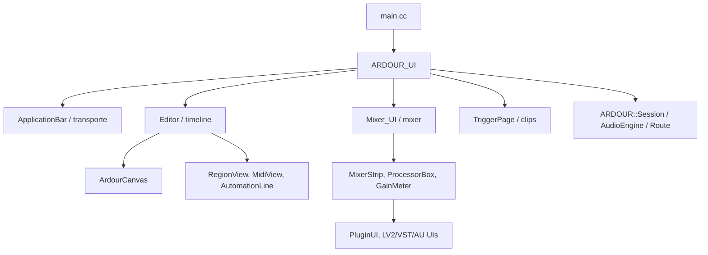

# Documentacion de `gtk2_ardour`

Generado para el arbol local `C:/ARDOURCUSTOM/ardour` el 2026-06-05. Esta guia esta escrita pensando en Ardour como DAW: editor multipista, mixer, transporte, plugins, MIDI, clips/cues, video y preferencias.

## Alcance

`gtk2_ardour` es la capa grafica clasica de Ardour. No contiene el motor DSP completo: para audio, sesion, rutas, plugins y transporte delega en bibliotecas como `libs/ardour`, `libs/pbd`, `libs/canvas`, `libs/widgets` y `libs/gtkmm2ext`. Lo que si concentra es la composicion visual, los dialogos, las acciones, el canvas del editor, el mixer, las paginas de MIDI/trigger y la integracion de recursos.

Cobertura de esta documentacion:

- Archivos totales en la carpeta: **1028**.
- Archivos de codigo C/C++/Objective-C++ documentados individualmente: **752** (`.cc`, `.h`, `.c`, `.mm`).
- Archivos auxiliares de frontend/build documentados en inventario: **61**.
- Imagenes, fuentes y traducciones se resumen por familia porque no son codigo fuente ejecutable.

## Como leer la carpeta

- Los `.h` declaran la interfaz de widgets, ventanas y controladores; los `.cc` suelen contener la construccion de GTK/YTK, conexiones de senales y sincronizacion con la sesion.
- Los nombres son bastante literales: `editor_*` pertenece al timeline, `mixer_*` al mezclador, `plugin_*` a plugins, `midi_*` al piano roll/MIDI, `trigger_*` a clips/cues, y `*_dialog` a dialogos.
- `wscript` es una pista importante: lista muchas fuentes que se compilan para el binario. Algunos archivos viven aqui como pruebas, soporte de plataforma o recursos condicionales.
- La UI usa `ytkmm`/GTKmm, `Gtkmm2ext`, `ArdourWidgets` y `ArdourCanvas`. Los objetos de dominio (`Session`, `Route`, `Region`, `Plugin`, `Trigger`, etc.) vienen de `ARDOUR` en las bibliotecas del motor.



## Mapa funcional

- **Arranque, aplicacion y acciones globales**: 56 archivos de codigo.
- **Audio, regiones y automatizacion**: 31 archivos de codigo.
- **Clips, cues y pagina Trigger**: 27 archivos de codigo.
- **Editor, timeline, seleccion y transporte**: 151 archivos de codigo.
- **Importacion, exportacion, analisis y video**: 72 archivos de codigo.
- **Infraestructura visual y utilidades compartidas**: 37 archivos de codigo.
- **MIDI, piano roll, notas y armonia**: 88 archivos de codigo.
- **Mixer, ruteo, strips y medidores**: 107 archivos de codigo.
- **Otros componentes transversales del frontend**: 54 archivos de codigo.
- **Plataforma, empaquetado y arranque**: 9 archivos de codigo.
- **Plugins, procesadores e interfaces externas**: 59 archivos de codigo.
- **Sesiones, preferencias, dialogos y utilidades**: 61 archivos de codigo.

### 1. Arranque y aplicacion

El flujo empieza en `main.cc`, configura idioma, opciones, senales del sistema y crea la instancia global de `ARDOUR_UI`. `ARDOUR_UI` coordina el ciclo de vida de la sesion, ventanas principales, acciones, dialogos y comunicacion con el backend de audio. `ApplicationBar` arma la franja superior tipica de un DAW: transporte, relojes, punch in/out, modo de grabacion, alertas de solo/audicion/feedback, latencia y medidor del editor.

### 2. Editor/timeline

`Editor` es la vista de arreglo. Se apoya en `ArdourCanvas` para dibujar regiones, reglas, cursores, rangos, lineas de tiempo y elementos arrastrables. La estructura se divide en muchos `editor_*.cc` para que las operaciones de mouse, seleccion, marcadores, rulers, imports, regiones, rutas y resumen visual no queden en un unico archivo gigantesco.

### 3. Mixer y ruteo

`Mixer_UI` contiene la pagina del mezclador; cada canal visible se representa con `MixerStrip`. Las tiras combinan `GainMeter`, `PannerUI`, botones de mute/solo/record, `ProcessorBox` para plugins/inserts/sends, y estados compartidos desde `RouteUI`. Los archivos `port_matrix_*`, `io_selector*`, `send_ui*`, `return_ui*` y `global_port_matrix*` cubren la parte de ruteo.

### 4. Plugins

Los archivos `plugin_*`, `lv2_*`, `vst*`, `au_*`, `processor_box*` y variantes de plataforma muestran como Ardour incrusta o abre interfaces de plugins. Hay dos caminos: UIs genericas construidas con controles propios, y UIs externas/nativas de LV2, VST, AudioUnit o VST3.

### 5. MIDI y piano roll

La familia `midi_*`, `pianoroll_*`, `note*`, `patch_change*`, `step_*`, `chord_*` e `instrument_selector*` cubre edicion de notas, nombres de instrumentos, cambios de banco/programa, sysex, seleccion MIDI, velocity y entrada por teclado/piano.

### 6. Clips, cues y Trigger

La pagina `TriggerPage` agrega una superficie tipo clip launcher: strips, slots, cue master, listas de fuentes/regiones/rutas y editores rapidos de clips. Es una capa mas reciente dentro del mismo frontend, conectada a la sesion y al mixer mediante `RouteProcessorSelection` y objetos `Trigger`.

### 7. Importacion, exportacion, analisis y video

Los modulos `export_*`, `sfdb_*`, `soundcloud_*`, `analysis_window*`, `fft*`, `loudness*`, `video_*`, `transcode_*` y `add_video_dialog*` son flujos de trabajo alrededor del DAW: entrada/salida de material, medicion, render, transcoding y soporte de timeline de video.

## Fragmentos para entender el frontend

### Punto de entrada y errores de backend

`main.cc` mezcla inicializacion grafica con manejo de backend de audio. Este fragmento muestra que la UI no es una app aislada: debe reaccionar si el motor de audio no arranca o muere.

```cpp
static ARDOUR_UI  *ui = 0;
static string localedir (LOCALEDIR);

void
gui_jack_error ()
{
	ArdourMessageDialog win (string_compose (_("%1 could not connect to the audio backend."), PROGRAM_NAME),
	                         false,
	                         Gtk::MESSAGE_INFO,
	                         Gtk::BUTTONS_NONE);

	win.add_button (Stock::QUIT, RESPONSE_CLOSE);
	win.set_default_response (RESPONSE_CLOSE);

	win.show_all ();
	win.set_position (Gtk::WIN_POS_CENTER);

	if (!no_splash) {
		ui->hide_splash ();
	}

	/* we just don't care about the result, but we want to block */

	win.run ();
```

### Barra superior de un DAW

`ApplicationBar` agrupa transporte, relojes, estados de grabacion, latencia y alertas. Es un buen archivo para ubicar controles visibles de la parte superior.

```cpp
class ApplicationBar : public Gtk::HBox, public ARDOUR::SessionHandlePtr
{
public:
	ApplicationBar ();
	~ApplicationBar();

	void set_session (ARDOUR::Session *);

	void focus_on_clock ();

private:
	void on_parent_changed (Gtk::Widget*);

	bool sync_button_clicked (GdkEventButton*);

	void parameter_changed (std::string);
	void ui_actions_ready ();
	void setup_tooltips ();

	void repack_transport_hbox ();

	void map_transport_state ();
	void set_transport_sensitivity (bool);

	void set_record_mode (ARDOUR::RecordMode);

	void latency_switch_changed ();
	void session_latency_updated (bool);

	void update_clock_visibility ();
	void every_point_zero_something_seconds ();

	void solo_blink (bool);
	void audition_blink (bool);
	void feedback_blink (bool);

	void soloing_changed (bool);
	void auditioning_changed (bool);
	void _auditioning_changed (bool);

	void feedback_detected ();
	void successful_graph_sort ();
```

### Canvas del editor

`Editor::initialize_canvas()` crea grupos con scroll horizontal/vertical, cursores, rectangulos de loop/punch, barras de marcadores y capas de arrastre. En Ardour, gran parte del frontend no es un layout GTK comun, sino un canvas especializado.

```cpp
Editor::initialize_canvas ()
{
	_track_canvas_viewport = new ArdourCanvas::GtkCanvasViewport (horizontal_adjustment, vertical_adjustment);
	_track_canvas = _track_canvas_viewport->canvas ();

	_track_canvas->set_background_color (UIConfiguration::instance().color ("arrange base"));
	_track_canvas->use_nsglview (UIConfiguration::instance().get_nsgl_view_mode () == NSGLHiRes);
#ifdef __APPLE__
	// as of april 12 2024 on X Window and Windows, setting this to false
	// causes redraw errors, but not on macOS as far as we can tell
	_track_canvas->set_single_exposure (false);
#endif

	/* scroll group for items that should not automatically scroll
	 *  (e.g verbose cursor). It shares the canvas coordinate space.
	*/
	no_scroll_group = new ArdourCanvas::Container (_track_canvas->root());

	_verbose_cursor.reset (new VerboseCursor (*this));

	ArdourCanvas::ScrollGroup* hsg;
	ArdourCanvas::ScrollGroup* hg;
	ArdourCanvas::ScrollGroup* cg;

	h_scroll_group = hg = new ArdourCanvas::ScrollGroup (_track_canvas->root(), ArdourCanvas::ScrollGroup::ScrollsHorizontally);
	CANVAS_DEBUG_NAME (h_scroll_group, "canvas h scroll");
	_track_canvas->add_scroller (*hg);

	hv_scroll_group = hsg = new ArdourCanvas::ScrollGroup (_track_canvas->root(),
							       ArdourCanvas::ScrollGroup::ScrollSensitivity (ArdourCanvas::ScrollGroup::ScrollsVertically|
													     ArdourCanvas::ScrollGroup::ScrollsHorizontally));
	CANVAS_DEBUG_NAME (hv_scroll_group, "canvas hv scroll");
	_track_canvas->add_scroller (*hsg);

	cursor_scroll_group = cg = new ArdourCanvas::ScrollGroup (_track_canvas->root(), ArdourCanvas::ScrollGroup::ScrollsHorizontally);
	CANVAS_DEBUG_NAME (cursor_scroll_group, "canvas cursor scroll");
	_track_canvas->add_scroller (*cg);

```

### Una pista en el timeline

`RouteTimeAxisView` conecta la nocion de ruta/pista del motor con seleccion, regiones, automatizacion, capas, paste y medidores dentro del editor.

```cpp
class RouteTimeAxisView : public RouteUI, public StripableTimeAxisView
{
public:
	RouteTimeAxisView (PublicEditor&, ARDOUR::Session*, ArdourCanvas::Canvas& canvas);
	virtual ~RouteTimeAxisView ();

	std::string name()  const;
	Gdk::Color color () const;
	bool marked_for_display () const;
	bool set_marked_for_display (bool);

	std::shared_ptr<ARDOUR::Stripable> stripable() const { return RouteUI::stripable(); }

	void set_route (std::shared_ptr<ARDOUR::Route>);

	void show_selection (TimeSelection&);
	void set_button_names ();

	void set_samples_per_pixel (double);
	void set_height (uint32_t h, TrackHeightMode m = OnlySelf, bool from_idle = false);
	void show_timestretch (Temporal::timepos_t const & start, Temporal::timepos_t const & end, int layers, int layer);
	void hide_timestretch ();
	void selection_click (GdkEventButton*);
	void set_selected_points (PointSelection&);
	void set_selected_regionviews (RegionSelection&);
	void _get_selectables (Temporal::timepos_t const &, Temporal::timepos_t const &, double top, double bot, std::list<Selectable *>&, bool within);
	void get_inverted_selectables (Selection&, std::list<Selectable*>&);
	void get_regionviews_at_or_after (Temporal::timepos_t const &, RegionSelection&);

	virtual void set_layer_display (LayerDisplay d);
	void toggle_layer_display ();
	LayerDisplay layer_display () const;

	std::shared_ptr<ARDOUR::Region> find_next_region (ARDOUR::timepos_t const & pos, ARDOUR::RegionPoint, int32_t dir);
	ARDOUR::timepos_t find_next_region_boundary (ARDOUR::timepos_t const & pos, int32_t dir);

	/* Editing operations */
	void cut_copy_clear (Selection&, Editing::CutCopyOp);
```

### Un canal del mixer

`MixerStrip` condensa la logica visible de un canal: medidor/fader, panner, procesadores, seleccion y estado de ruta.

```cpp
class MixerStrip : public AxisView, public RouteUI, public Gtk::EventBox
{
public:
	MixerStrip (Mixer_UI&, ARDOUR::Session*, std::shared_ptr<ARDOUR::Route>, bool in_mixer = true);
	MixerStrip (Mixer_UI&, ARDOUR::Session*, bool in_mixer = true);
	~MixerStrip ();

	std::string name()  const;
	Gdk::Color color () const;
	bool marked_for_display () const;
	bool set_marked_for_display (bool);

	std::shared_ptr<ARDOUR::Stripable> stripable() const { return RouteUI::stripable(); }

	void set_width_enum (Width, void* owner);
	Width get_width_enum () const { return _width; }
	void* width_owner () const { return _width_owner; }

	GainMeter&      gain_meter()      { return gpm; }
	PannerUI&       panner_ui()       { return panners; }
	PluginSelector* plugin_selector();

	void fast_update ();
	void set_embedded (bool);

	void set_route (std::shared_ptr<ARDOUR::Route>);
	void set_button_names ();
	void show_send (std::shared_ptr<ARDOUR::Send>);
	void revert_to_default_display ();

	/** @return the delivery that is being edited using our fader; it will be the
	 *  last send passed to \ref show_send() , or our route's main out delivery.
	 */
	std::shared_ptr<ARDOUR::Delivery> current_delivery () const {
		return _current_delivery;
	}

	bool mixer_owned () const {
		return _mixer_owned;
	}

	/* used for screenshots */
```

### Plugins y presets

`PlugUIBase` define controles comunes a UIs de plugins: presets, bypass, pines de ruteo, latencia, tail time y modos de automatizacion.

```cpp
class PlugUIBase : public virtual sigc::trackable, public PBD::ScopedConnectionList
{
public:
	PlugUIBase (std::shared_ptr<ARDOUR::PlugInsertBase>);
	virtual ~PlugUIBase();

	virtual gint get_preferred_height () = 0;
	virtual gint get_preferred_width () = 0;
	virtual bool resizable () { return true; }
	virtual bool start_updating(GdkEventAny*) = 0;
	virtual bool stop_updating(GdkEventAny*) = 0;

	virtual bool is_external () const { return false; }
	virtual bool is_external_visible () const { return false; }

	virtual void activate () {}
	virtual void deactivate () {}

	void update_preset_list ();
	void update_preset ();

	void latency_button_clicked ();
	void tailtime_button_clicked ();

	virtual bool on_window_show(const std::string& /*title*/) { return true; }
	virtual void on_window_hide() {}

	virtual void forward_key_event (GdkEventKey*) {}
	virtual void grab_focus () {}
	virtual bool non_gtk_gui() const { return false; }

	sigc::signal<void,bool> KeyboardFocused;

protected:
	std::shared_ptr<ARDOUR::PlugInsertBase> _pib;
	std::shared_ptr<ARDOUR::PluginInsert> _pi;
	std::shared_ptr<ARDOUR::Plugin> plugin;

	void add_common_widgets (Gtk::HBox*, bool with_focus = true);

	/* UI elements that subclasses can add to their widgets */

	/** a ComboBoxText which lists presets and manages their selection */
	ArdourWidgets::ArdourDropdown _preset_combo;
	/** a label which has a * in if the current settings are different from the preset being shown */
	Gtk::Label _preset_modified;
```

### MIDI

`MidiView` muestra el tipo de operaciones que vive en el editor MIDI: notas, patch changes, sysex, pegado, seleccion y cursor de step editing.

```cpp
class MidiView : public virtual sigc::trackable, public LineMerger
{
  public:
	typedef Evoral::Note<Temporal::Beats> NoteType;
	typedef Evoral::Sequence<Temporal::Beats>::Notes Notes;

	MidiView (std::shared_ptr<ARDOUR::MidiTrack> mt,
	          ArdourCanvas::Item&      parent,
	          EditingContext&          ec,
	          MidiViewBackground&      bg);
	MidiView (MidiView const & other);

	virtual ~MidiView ();

	void init (bool wfd);

	void set_sensitive (bool);

	virtual void set_samples_per_pixel (double) {};

	virtual bool display_is_enabled() const { return true; }

	virtual ArdourCanvas::Item* drag_group() const = 0;

	void step_add_note (uint8_t channel, uint8_t number, uint8_t velocity,
	                    Temporal::Beats pos, Temporal::Beats len);
	void step_sustain (Temporal::Beats beats);
	virtual void set_height (double);
	void apply_note_range(uint8_t lowest, uint8_t highest, bool force=false);

	// inline ARDOUR::ColorMode color_mode() const { return _background->color_mode(); }

	virtual void color_handler ();

	void show_step_edit_cursor (Temporal::Beats pos);
	void move_step_edit_cursor (Temporal::Beats pos);
	void hide_step_edit_cursor ();
	void set_step_edit_cursor_width (Temporal::Beats beats);

	virtual GhostRegion* add_ghost (TimeAxisView&) { return nullptr; }
	virtual std::string get_modifier_name() const;

	virtual void set_region (std::shared_ptr<ARDOUR::MidiRegion>);
	virtual void set_track (std::shared_ptr<ARDOUR::MidiTrack>);
	virtual void set_model (std::shared_ptr<ARDOUR::MidiModel>);

```

### Trigger page

`TriggerPage` es una composicion de widgets para clips/cues, con sidebar, strips, cue master y editores de propiedades.

```cpp
class TriggerPage : public ArdourWidgets::Tabbable, public ARDOUR::SessionHandlePtr, public PBD::ScopedConnectionList, public AxisViewProvider
{
public:
	TriggerPage ();
	~TriggerPage ();

	void set_session (ARDOUR::Session*);

	XMLNode& get_state () const;
	int      set_state (const XMLNode&, int /* version */);

	Gtk::Window* use_own_window (bool and_fill_it);

	RouteProcessorSelection& selection() { return _selection; }

	void focus_on_clock();

private:
	void load_bindings ();
	void register_actions ();
	void update_title ();
	void session_going_away ();
	void parameter_changed (std::string const&);

	void initial_track_display ();
	void add_routes (ARDOUR::RouteList&);
	void remove_route (TriggerStrip*);

	void clear_selected_slot ();
	void hide_all ();
	void redisplay_track_list ();
	void pi_property_changed (PBD::PropertyChange const&);
	void stripable_property_changed (PBD::PropertyChange const&, std::weak_ptr<ARDOUR::Stripable>);

	void showhide_att_bottom (bool);

	void rec_state_changed ();
	void rec_state_clicked ();

	void add_sidebar_page (std::string const&, std::string const&, Gtk::Widget&);

	bool strip_button_release_event (GdkEventButton*, TriggerStrip*);
	bool no_strip_button_event (GdkEventButton*);
	bool no_strip_drag_motion (Glib::RefPtr<Gdk::DragContext> const&, int, int, guint);
	void no_strip_drag_data_received (Glib::RefPtr<Gdk::DragContext> const&, int, int, Gtk::SelectionData const&, guint, guint);

```

## Guia por archivo de codigo

La explicacion es intencionalmente sencilla. Para archivos `.cc` se describe la implementacion; para `.h`, la declaracion publica o privada que otros modulos consumen. La columna "estado" indica si el archivo aparece como fuente compilada en `gtk2_ardour/wscript`, si es cabecera o si parece auxiliar/condicional.

### Arranque, aplicacion y acciones globales

| Archivo | Estado | Explicacion sencilla | Simbolos detectados |
|---|---|---|---|
| `gtk2_ardour/about.cc` | Fuente compilada | Implementa about. Aporta al arranque, ventana principal, acciones globales o estado de aplicacion. | About |
| `gtk2_ardour/about.h` | Cabecera | Declara la interfaz de about. Aporta al arranque, ventana principal, acciones globales o estado de aplicacion. | About |
| `gtk2_ardour/actions.cc` | Fuente compilada | Implementa acciones GTK usadas por menus, atajos y botones. Aporta al arranque, ventana principal, acciones globales o estado de aplicacion. | - |
| `gtk2_ardour/actions.h` | Cabecera | Declara la interfaz de acciones GTK usadas por menus, atajos y botones. Aporta al arranque, ventana principal, acciones globales o estado de aplicacion. | - |
| `gtk2_ardour/application_bar.cc` | Fuente compilada | Implementa barra superior con transporte, relojes, alertas y controles de sesion. Aporta al arranque, ventana principal, acciones globales o estado de aplicacion. | ApplicationBar |
| `gtk2_ardour/application_bar.h` | Cabecera | Declara la interfaz de barra superior con transporte, relojes, alertas y controles de sesion. Aporta al arranque, ventana principal, acciones globales o estado de aplicacion. | ApplicationBar |
| `gtk2_ardour/ardour_dialog.cc` | Fuente compilada | Implementa dialogo de ardour. Aporta al arranque, ventana principal, acciones globales o estado de aplicacion. | ArdourDialog |
| `gtk2_ardour/ardour_dialog.h` | Cabecera | Declara la interfaz de dialogo de ardour. Aporta al arranque, ventana principal, acciones globales o estado de aplicacion. | ArdourDialog |
| `gtk2_ardour/ardour_message.cc` | Fuente compilada | Implementa dialogos de mensajes y avisos de Ardour. Aporta al arranque, ventana principal, acciones globales o estado de aplicacion. | ArdourMessageDialog |
| `gtk2_ardour/ardour_message.h` | Cabecera | Declara la interfaz de dialogos de mensajes y avisos de Ardour. Aporta al arranque, ventana principal, acciones globales o estado de aplicacion. | ArdourMessageDialog |
| `gtk2_ardour/ardour_ui.cc` | Fuente compilada | Implementa componente UI de ardour. Aporta al arranque, ventana principal, acciones globales o estado de aplicacion. | CleanupResultsModelColumns |
| `gtk2_ardour/ardour_ui.h` | Cabecera | Declara la interfaz de componente UI de ardour. Aporta al arranque, ventana principal, acciones globales o estado de aplicacion. | ARDOUR_UI |
| `gtk2_ardour/ardour_ui2.cc` | Fuente compilada | Implementa parte complementaria del controlador principal. Aporta al arranque, ventana principal, acciones globales o estado de aplicacion. | - |
| `gtk2_ardour/ardour_ui3.cc` | Fuente compilada | Implementa parte complementaria del controlador principal. Aporta al arranque, ventana principal, acciones globales o estado de aplicacion. | - |
| `gtk2_ardour/ardour_ui_aaf.cc` | Fuente compilada | Implementa ardour UI aaf. Aporta al arranque, ventana principal, acciones globales o estado de aplicacion. | - |
| `gtk2_ardour/ardour_ui_access_web.cc` | Fuente compilada | Implementa ardour UI access web. Aporta al arranque, ventana principal, acciones globales o estado de aplicacion. | - |
| `gtk2_ardour/ardour_ui_dependents.cc` | Fuente compilada | Implementa ardour UI dependents. Aporta al arranque, ventana principal, acciones globales o estado de aplicacion. | - |
| `gtk2_ardour/ardour_ui_dialogs.cc` | Fuente compilada | Implementa ardour UI dialogs. Aporta al arranque, ventana principal, acciones globales o estado de aplicacion. | - |
| `gtk2_ardour/ardour_ui_ed.cc` | Fuente compilada | Implementa ardour UI ed. Aporta al arranque, ventana principal, acciones globales o estado de aplicacion. | - |
| `gtk2_ardour/ardour_ui_engine.cc` | Fuente compilada | Implementa ardour UI engine. Aporta al arranque, ventana principal, acciones globales o estado de aplicacion. | - |
| `gtk2_ardour/ardour_ui_keys.cc` | Fuente compilada | Implementa ardour UI keys. Aporta al arranque, ventana principal, acciones globales o estado de aplicacion. | - |
| `gtk2_ardour/ardour_ui_mixer.cc` | Fuente compilada | Implementa ardour UI mixer. Aporta al arranque, ventana principal, acciones globales o estado de aplicacion. | - |
| `gtk2_ardour/ardour_ui_options.cc` | Fuente compilada | Implementa ardour UI options. Aporta al arranque, ventana principal, acciones globales o estado de aplicacion. | - |
| `gtk2_ardour/ardour_ui_session.cc` | Fuente compilada | Implementa ardour UI session. Aporta al arranque, ventana principal, acciones globales o estado de aplicacion. | - |
| `gtk2_ardour/ardour_ui_startup.cc` | Fuente compilada | Implementa ardour UI startup. Aporta al arranque, ventana principal, acciones globales o estado de aplicacion. | - |
| `gtk2_ardour/ardour_ui_video.cc` | Fuente compilada | Implementa ardour UI video. Aporta al arranque, ventana principal, acciones globales o estado de aplicacion. | - |
| `gtk2_ardour/ardour_window.cc` | Fuente compilada | Implementa ventana de ardour. Aporta al arranque, ventana principal, acciones globales o estado de aplicacion. | ArdourWindow |
| `gtk2_ardour/ardour_window.h` | Cabecera | Declara la interfaz de ventana de ardour. Aporta al arranque, ventana principal, acciones globales o estado de aplicacion. | ArdourWindow |
| `gtk2_ardour/configinfo.cc` | Fuente compilada | Implementa configinfo. Aporta al arranque, ventana principal, acciones globales o estado de aplicacion. | ConfigInfoDialog |
| `gtk2_ardour/configinfo.h` | Cabecera | Declara la interfaz de configinfo. Aporta al arranque, ventana principal, acciones globales o estado de aplicacion. | ConfigInfoDialog |
| `gtk2_ardour/debug.cc` | Fuente compilada | Implementa debug. Aporta al arranque, ventana principal, acciones globales o estado de aplicacion. | - |
| `gtk2_ardour/debug.h` | Cabecera | Declara la interfaz de debug. Aporta al arranque, ventana principal, acciones globales o estado de aplicacion. | - |
| `gtk2_ardour/gui_object.cc` | Fuente compilada | Implementa gui object. Aporta al arranque, ventana principal, acciones globales o estado de aplicacion. | GUIObjectState |
| `gtk2_ardour/gui_object.h` | Cabecera | Declara la interfaz de gui object. Aporta al arranque, ventana principal, acciones globales o estado de aplicacion. | GUIObjectState |
| `gtk2_ardour/gui_thread.h` | Cabecera | Declara la interfaz de gui thread. Aporta al arranque, ventana principal, acciones globales o estado de aplicacion. | - |
| `gtk2_ardour/keyboard.cc` | Fuente compilada | Implementa gestion de teclado, atajos y modificadores. Aporta al arranque, ventana principal, acciones globales o estado de aplicacion. | ArdourKeyboard |
| `gtk2_ardour/keyboard.h` | Cabecera | Declara la interfaz de gestion de teclado, atajos y modificadores. Aporta al arranque, ventana principal, acciones globales o estado de aplicacion. | ArdourKeyboard |
| `gtk2_ardour/keyeditor.cc` | Fuente compilada | Implementa keyeditor. Aporta al arranque, ventana principal, acciones globales o estado de aplicacion. | KeyEditor, Tab, KeyEditorColumns |
| `gtk2_ardour/keyeditor.h` | Cabecera | Declara la interfaz de keyeditor. Aporta al arranque, ventana principal, acciones globales o estado de aplicacion. | KeyEditor, Tab, KeyEditorColumns |
| `gtk2_ardour/main.cc` | Fuente compilada | Implementa punto de entrada de la aplicacion grafica. Aporta al arranque, ventana principal, acciones globales o estado de aplicacion. | - |
| `gtk2_ardour/nag.cc` | Fuente compilada | Implementa nag. Aporta al arranque, ventana principal, acciones globales o estado de aplicacion. | NagScreen |
| `gtk2_ardour/nag.h` | Cabecera | Declara la interfaz de nag. Aporta al arranque, ventana principal, acciones globales o estado de aplicacion. | NagScreen |
| `gtk2_ardour/nsm.cc` | Fuente compilada | Implementa NSM. Aporta al arranque, ventana principal, acciones globales o estado de aplicacion. | NSM_Client |
| `gtk2_ardour/nsm.h` | Cabecera | Declara la interfaz de NSM. Aporta al arranque, ventana principal, acciones globales o estado de aplicacion. | NSM_Client |
| `gtk2_ardour/nsmclient.cc` | Fuente compilada | Implementa nsmclient. Aporta al arranque, ventana principal, acciones globales o estado de aplicacion. | Client |
| `gtk2_ardour/nsmclient.h` | Cabecera | Declara la interfaz de nsmclient. Aporta al arranque, ventana principal, acciones globales o estado de aplicacion. | Client |
| `gtk2_ardour/opts.cc` | Fuente compilada | Implementa opts. Aporta al arranque, ventana principal, acciones globales o estado de aplicacion. | - |
| `gtk2_ardour/opts.h` | Cabecera | Declara la interfaz de opts. Aporta al arranque, ventana principal, acciones globales o estado de aplicacion. | - |
| `gtk2_ardour/splash.cc` | Fuente compilada | Implementa splash. Aporta al arranque, ventana principal, acciones globales o estado de aplicacion. | Splash |
| `gtk2_ardour/splash.h` | Cabecera | Declara la interfaz de splash. Aporta al arranque, ventana principal, acciones globales o estado de aplicacion. | Splash |
| `gtk2_ardour/startup_fsm.cc` | Fuente compilada | Implementa startup fsm. Aporta al arranque, ventana principal, acciones globales o estado de aplicacion. | StartupFSM |
| `gtk2_ardour/startup_fsm.h` | Cabecera | Declara la interfaz de startup fsm. Aporta al arranque, ventana principal, acciones globales o estado de aplicacion. | StartupFSM |
| `gtk2_ardour/timers.cc` | Fuente compilada | Implementa timers. Aporta al arranque, ventana principal, acciones globales o estado de aplicacion. | StandardTimer, BlinkTimer, UITimers |
| `gtk2_ardour/timers.h` | Cabecera | Declara la interfaz de timers. Aporta al arranque, ventana principal, acciones globales o estado de aplicacion. | TimerSuspender |
| `gtk2_ardour/window_manager.cc` | Fuente compilada | Implementa gestor de window. Aporta al arranque, ventana principal, acciones globales o estado de aplicacion. | Manager, ProxyBase, ProxyTemporary, ProxyWithConstructor, Proxy |
| `gtk2_ardour/window_manager.h` | Cabecera | Declara la interfaz de gestor de window. Aporta al arranque, ventana principal, acciones globales o estado de aplicacion. | Manager, ProxyBase, ProxyTemporary, ProxyWithConstructor, Proxy |

### Audio, regiones y automatizacion

| Archivo | Estado | Explicacion sencilla | Simbolos detectados |
|---|---|---|---|
| `gtk2_ardour/audio_clip_editor.cc` | Fuente compilada | Implementa editor de audio clip. | AudioClipEditor, ClipMetric |
| `gtk2_ardour/audio_clip_editor.h` | Cabecera | Declara la interfaz de editor de audio clip. | AudioClipEditor, ClipMetric |
| `gtk2_ardour/audio_region_editor.cc` | Fuente compilada | Implementa editor de audio region. | AudioRegionEditor |
| `gtk2_ardour/audio_region_editor.h` | Cabecera | Declara la interfaz de editor de audio region. | AudioRegionEditor |
| `gtk2_ardour/audio_region_operations_box.cc` | Fuente condicional o auxiliar | Implementa panel de controles de audio region operations. | RegionOperationsBox, AudioRegionOperationsBox |
| `gtk2_ardour/audio_region_operations_box.h` | Cabecera | Declara la interfaz de panel de controles de audio region operations. | RegionOperationsBox, AudioRegionOperationsBox |
| `gtk2_ardour/audio_region_view.cc` | Fuente compilada | Implementa vista de audio region. | AudioRegionView |
| `gtk2_ardour/audio_region_view.h` | Cabecera | Declara la interfaz de vista de audio region. | AudioRegionView |
| `gtk2_ardour/audio_streamview.cc` | Fuente compilada | Implementa vista de flujo de audio. | AudioStreamView |
| `gtk2_ardour/audio_streamview.h` | Cabecera | Declara la interfaz de vista de flujo de audio. | AudioStreamView |
| `gtk2_ardour/audio_time_axis.cc` | Fuente compilada | Implementa pista/eje temporal de audio. | AudioTimeAxisView |
| `gtk2_ardour/audio_time_axis.h` | Cabecera | Declara la interfaz de pista/eje temporal de audio. | AudioTimeAxisView |
| `gtk2_ardour/audio_trigger_properties_box.cc` | Fuente compilada | Implementa panel de controles de audio trigger properties. | TriggerPropertiesBox, AudioTriggerPropertiesBox |
| `gtk2_ardour/audio_trigger_properties_box.h` | Cabecera | Declara la interfaz de panel de controles de audio trigger properties. | TriggerPropertiesBox, AudioTriggerPropertiesBox |
| `gtk2_ardour/automation_controller.cc` | Fuente compilada | Implementa automation controller. | AutomationBarController, AutomationController |
| `gtk2_ardour/automation_controller.h` | Cabecera | Declara la interfaz de automation controller. | AutomationBarController, AutomationController |
| `gtk2_ardour/automation_line.cc` | Fuente compilada | Implementa linea visual o de automatizacion de automation. | ControlPointSorter |
| `gtk2_ardour/automation_line.h` | Cabecera | Declara la interfaz de linea visual o de automatizacion de automation. | AutomationLine, ContiguousControlPoints |
| `gtk2_ardour/automation_region_view.cc` | Fuente compilada | Implementa vista de automation region. | AutomationRegionView |
| `gtk2_ardour/automation_region_view.h` | Cabecera | Declara la interfaz de vista de automation region. | AutomationRegionView |
| `gtk2_ardour/automation_selection.h` | Cabecera | Declara la interfaz de modelo de seleccion de automation. | AutomationSelection |
| `gtk2_ardour/automation_streamview.cc` | Fuente compilada | Implementa vista de flujo de automation. | AutomationStreamView |
| `gtk2_ardour/automation_streamview.h` | Cabecera | Declara la interfaz de vista de flujo de automation. | AutomationStreamView |
| `gtk2_ardour/automation_text_entry.cc` | Fuente compilada | Implementa automation text entry. | AutomationTextEntry |
| `gtk2_ardour/automation_text_entry.h` | Cabecera | Declara la interfaz de automation text entry. | AutomationTextEntry |
| `gtk2_ardour/automation_time_axis.cc` | Fuente compilada | Implementa pista/eje temporal de automation. | AutomationTimeAxisView |
| `gtk2_ardour/automation_time_axis.h` | Cabecera | Declara la interfaz de pista/eje temporal de automation. | AutomationTimeAxisView |
| `gtk2_ardour/midi_automation_line.cc` | Fuente compilada | Implementa linea visual o de automatizacion de MIDI automation. | MidiAutomationLine |
| `gtk2_ardour/midi_automation_line.h` | Cabecera | Declara la interfaz de linea visual o de automatizacion de MIDI automation. | MidiAutomationLine |
| `gtk2_ardour/pianoroll_automation_line.cc` | Fuente compilada | Implementa linea visual o de automatizacion de pianoroll automation. | PianorollAutomationLine |
| `gtk2_ardour/pianoroll_automation_line.h` | Cabecera | Declara la interfaz de linea visual o de automatizacion de pianoroll automation. | PianorollAutomationLine |

### Clips, cues y pagina Trigger

| Archivo | Estado | Explicacion sencilla | Simbolos detectados |
|---|---|---|---|
| `gtk2_ardour/cue_editor.cc` | Fuente compilada | Implementa editor de cue. Se lee desde el flujo de clips/cues y edicion por lanzadores. | CueEditor |
| `gtk2_ardour/cue_editor.h` | Cabecera | Declara la interfaz de editor de cue. Se lee desde el flujo de clips/cues y edicion por lanzadores. | CueEditor |
| `gtk2_ardour/cuebox_ui.cc` | Fuente compilada | Implementa componente UI de cuebox. Se lee desde el flujo de clips/cues y edicion por lanzadores. | CueEntry, CueBoxUI, CueBoxWidget, CueBoxWindow |
| `gtk2_ardour/cuebox_ui.h` | Cabecera | Declara la interfaz de componente UI de cuebox. Se lee desde el flujo de clips/cues y edicion por lanzadores. | CueEntry, CueBoxUI, CueBoxWidget, CueBoxWindow |
| `gtk2_ardour/slot_properties_box.cc` | Fuente compilada | Implementa panel de controles de slot properties. Se lee desde el flujo de clips/cues y edicion por lanzadores. | SlotPropertyTable, SlotPropertyWidget, SlotPropertiesBox |
| `gtk2_ardour/slot_properties_box.h` | Cabecera | Declara la interfaz de panel de controles de slot properties. Se lee desde el flujo de clips/cues y edicion por lanzadores. | SlotPropertyTable, SlotPropertyWidget, SlotPropertiesBox |
| `gtk2_ardour/trigger_clip_picker.cc` | Fuente compilada | Implementa trigger clip picker. Se lee desde el flujo de clips/cues y edicion por lanzadores. | TriggerClipPicker, Columns |
| `gtk2_ardour/trigger_clip_picker.h` | Cabecera | Declara la interfaz de trigger clip picker. Se lee desde el flujo de clips/cues y edicion por lanzadores. | TriggerClipPicker, Columns |
| `gtk2_ardour/trigger_jump_dialog.cc` | Fuente compilada | Implementa dialogo de trigger jump. Se lee desde el flujo de clips/cues y edicion por lanzadores. | TriggerJumpDialog |
| `gtk2_ardour/trigger_jump_dialog.h` | Cabecera | Declara la interfaz de dialogo de trigger jump. Se lee desde el flujo de clips/cues y edicion por lanzadores. | TriggerJumpDialog |
| `gtk2_ardour/trigger_master.cc` | Fuente compilada | Implementa trigger master. Se lee desde el flujo de clips/cues y edicion por lanzadores. | Loopster, TriggerMaster, CueMaster |
| `gtk2_ardour/trigger_master.h` | Cabecera | Declara la interfaz de trigger master. Se lee desde el flujo de clips/cues y edicion por lanzadores. | Loopster, TriggerMaster, CueMaster |
| `gtk2_ardour/trigger_page.cc` | Fuente compilada | Implementa pagina de clips/cues tipo launcher. Se lee desde el flujo de clips/cues y edicion por lanzadores. | TriggerStripSorter |
| `gtk2_ardour/trigger_page.h` | Cabecera | Declara la interfaz de pagina de clips/cues tipo launcher. Se lee desde el flujo de clips/cues y edicion por lanzadores. | TriggerPage |
| `gtk2_ardour/trigger_region_list.cc` | Fuente compilada | Implementa trigger region list. Se lee desde el flujo de clips/cues y edicion por lanzadores. | TriggerRegionList |
| `gtk2_ardour/trigger_region_list.h` | Cabecera | Declara la interfaz de trigger region list. Se lee desde el flujo de clips/cues y edicion por lanzadores. | TriggerRegionList |
| `gtk2_ardour/trigger_route_list.cc` | Fuente compilada | Implementa trigger route list. Se lee desde el flujo de clips/cues y edicion por lanzadores. | TriggerRouteList |
| `gtk2_ardour/trigger_route_list.h` | Cabecera | Declara la interfaz de trigger route list. Se lee desde el flujo de clips/cues y edicion por lanzadores. | TriggerRouteList |
| `gtk2_ardour/trigger_selection.h` | Cabecera | Declara la interfaz de modelo de seleccion de trigger. Se lee desde el flujo de clips/cues y edicion por lanzadores. | TriggerSelection |
| `gtk2_ardour/trigger_source_list.cc` | Fuente compilada | Implementa trigger source list. Se lee desde el flujo de clips/cues y edicion por lanzadores. | TriggerSourceList |
| `gtk2_ardour/trigger_source_list.h` | Cabecera | Declara la interfaz de trigger source list. Se lee desde el flujo de clips/cues y edicion por lanzadores. | TriggerSourceList |
| `gtk2_ardour/trigger_strip.cc` | Fuente compilada | Implementa trigger strip. Se lee desde el flujo de clips/cues y edicion por lanzadores. | TriggerStrip |
| `gtk2_ardour/trigger_strip.h` | Cabecera | Declara la interfaz de trigger strip. Se lee desde el flujo de clips/cues y edicion por lanzadores. | TriggerStrip |
| `gtk2_ardour/trigger_ui.cc` | Fuente compilada | Implementa componente UI de trigger. Se lee desde el flujo de clips/cues y edicion por lanzadores. | TriggerUI |
| `gtk2_ardour/trigger_ui.h` | Cabecera | Declara la interfaz de componente UI de trigger. Se lee desde el flujo de clips/cues y edicion por lanzadores. | TriggerUI |
| `gtk2_ardour/triggerbox_ui.cc` | Fuente compilada | Implementa componente UI de triggerbox. Se lee desde el flujo de clips/cues y edicion por lanzadores. | TriggerEntry, TriggerBoxUI, TriggerBoxWidget |
| `gtk2_ardour/triggerbox_ui.h` | Cabecera | Declara la interfaz de componente UI de triggerbox. Se lee desde el flujo de clips/cues y edicion por lanzadores. | TriggerEntry, TriggerBoxUI, TriggerBoxWidget |

### Editor, timeline, seleccion y transporte

| Archivo | Estado | Explicacion sencilla | Simbolos detectados |
|---|---|---|---|
| `gtk2_ardour/audio_clock.cc` | Fuente compilada | Implementa widget de reloj editable para tiempos musicales o muestras. Se lee como parte del editor de arreglos: seleccion, canvas, regiones, reglas o transporte. | AudioClock |
| `gtk2_ardour/audio_clock.h` | Cabecera | Declara la interfaz de widget de reloj editable para tiempos musicales o muestras. Se lee como parte del editor de arreglos: seleccion, canvas, regiones, reglas o transporte. | AudioClock |
| `gtk2_ardour/big_clock_window.cc` | Fuente compilada | Implementa ventana de big clock. Se lee como parte del editor de arreglos: seleccion, canvas, regiones, reglas o transporte. | BigClockWindow |
| `gtk2_ardour/big_clock_window.h` | Cabecera | Declara la interfaz de ventana de big clock. Se lee como parte del editor de arreglos: seleccion, canvas, regiones, reglas o transporte. | BigClockWindow |
| `gtk2_ardour/big_transport_window.cc` | Fuente compilada | Implementa ventana de big transport. Se lee como parte del editor de arreglos: seleccion, canvas, regiones, reglas o transporte. | BigTransportWindow |
| `gtk2_ardour/big_transport_window.h` | Cabecera | Declara la interfaz de ventana de big transport. Se lee como parte del editor de arreglos: seleccion, canvas, regiones, reglas o transporte. | BigTransportWindow |
| `gtk2_ardour/boundary.cc` | Fuente compilada | Implementa boundary. Se lee como parte del editor de arreglos: seleccion, canvas, regiones, reglas o transporte. | StartBoundaryRect, EndBoundaryRect |
| `gtk2_ardour/boundary.h` | Cabecera | Declara la interfaz de boundary. Se lee como parte del editor de arreglos: seleccion, canvas, regiones, reglas o transporte. | StartBoundaryRect, EndBoundaryRect |
| `gtk2_ardour/clock_group.cc` | Fuente compilada | Implementa clock group. Se lee como parte del editor de arreglos: seleccion, canvas, regiones, reglas o transporte. | ClockGroup |
| `gtk2_ardour/clock_group.h` | Cabecera | Declara la interfaz de clock group. Se lee como parte del editor de arreglos: seleccion, canvas, regiones, reglas o transporte. | ClockGroup |
| `gtk2_ardour/control_point.cc` | Fuente compilada | Implementa control point. Se lee como parte del editor de arreglos: seleccion, canvas, regiones, reglas o transporte. | ControlPoint |
| `gtk2_ardour/control_point.h` | Cabecera | Declara la interfaz de control point. Se lee como parte del editor de arreglos: seleccion, canvas, regiones, reglas o transporte. | ControlPoint |
| `gtk2_ardour/control_point_dialog.cc` | Fuente compilada | Implementa dialogo de control point. Se lee como parte del editor de arreglos: seleccion, canvas, regiones, reglas o transporte. | ControlPointDialog |
| `gtk2_ardour/control_point_dialog.h` | Cabecera | Declara la interfaz de dialogo de control point. Se lee como parte del editor de arreglos: seleccion, canvas, regiones, reglas o transporte. | ControlPointDialog |
| `gtk2_ardour/cross_cursor.cc` | Fuente compilada | Implementa cross cursor. Se lee como parte del editor de arreglos: seleccion, canvas, regiones, reglas o transporte. | CrossCursor |
| `gtk2_ardour/cross_cursor.h` | Cabecera | Declara la interfaz de cross cursor. Se lee como parte del editor de arreglos: seleccion, canvas, regiones, reglas o transporte. | CrossCursor |
| `gtk2_ardour/crossfade_edit.h` | Cabecera | Declara la interfaz de crossfade edit. Se lee como parte del editor de arreglos: seleccion, canvas, regiones, reglas o transporte. | CrossfadeEditor, PresetPoint, Preset, Point, PointSorter, Half |
| `gtk2_ardour/editing.cc` | Fuente compilada | Implementa tipos y utilidades del dominio de edicion. Se lee como parte del editor de arreglos: seleccion, canvas, regiones, reglas o transporte. | - |
| `gtk2_ardour/editing.h` | Cabecera | Declara la interfaz de tipos y utilidades del dominio de edicion. Se lee como parte del editor de arreglos: seleccion, canvas, regiones, reglas o transporte. | - |
| `gtk2_ardour/editing_context.cc` | Fuente compilada | Implementa editing context. Se lee como parte del editor de arreglos: seleccion, canvas, regiones, reglas o transporte. | EditingContext, CursorRAII, AutomationRecord, VisualChange |
| `gtk2_ardour/editing_context.h` | Cabecera | Declara la interfaz de editing context. Se lee como parte del editor de arreglos: seleccion, canvas, regiones, reglas o transporte. | EditingContext, CursorRAII, AutomationRecord, VisualChange |
| `gtk2_ardour/editing_convert.h` | Cabecera | Declara la interfaz de editing convert. Se lee como parte del editor de arreglos: seleccion, canvas, regiones, reglas o transporte. | - |
| `gtk2_ardour/editing_syms.inc.h` | Cabecera | Declara la interfaz de editing syms.inc. Se lee como parte del editor de arreglos: seleccion, canvas, regiones, reglas o transporte. | - |
| `gtk2_ardour/editor.cc` | Fuente compilada | Implementa vista principal de edicion: timeline, pistas, regiones, reglas y herramientas. Se lee como parte del editor de arreglos: seleccion, canvas, regiones, reglas o transporte. | EditorOrderTimeAxisSorter, TrackViewStripableSorter |
| `gtk2_ardour/editor.h` | Cabecera | Declara la interfaz de vista principal de edicion: timeline, pistas, regiones, reglas y herramientas. Se lee como parte del editor de arreglos: seleccion, canvas, regiones, reglas o transporte. | Editor, VisualState, LocationMarkers, EditorImportStatus, TrackDrag |
| `gtk2_ardour/editor_actions.cc` | Fuente compilada | Implementa editor actions. Se lee como parte del editor de arreglos: seleccion, canvas, regiones, reglas o transporte. | GTStrings |
| `gtk2_ardour/editor_audio_import.cc` | Fuente compilada | Implementa editor audio import. Se lee como parte del editor de arreglos: seleccion, canvas, regiones, reglas o transporte. | - |
| `gtk2_ardour/editor_audiotrack.cc` | Fuente compilada | Implementa editor audiotrack. Se lee como parte del editor de arreglos: seleccion, canvas, regiones, reglas o transporte. | - |
| `gtk2_ardour/editor_automation_line.cc` | Fuente compilada | Implementa linea visual o de automatizacion de editor automation. Se lee como parte del editor de arreglos: seleccion, canvas, regiones, reglas o transporte. | EditorAutomationLine |
| `gtk2_ardour/editor_automation_line.h` | Cabecera | Declara la interfaz de linea visual o de automatizacion de editor automation. Se lee como parte del editor de arreglos: seleccion, canvas, regiones, reglas o transporte. | EditorAutomationLine |
| `gtk2_ardour/editor_canvas.cc` | Fuente compilada | Implementa editor canvas. Se lee como parte del editor de arreglos: seleccion, canvas, regiones, reglas o transporte. | - |
| `gtk2_ardour/editor_canvas_events.cc` | Fuente compilada | Implementa editor canvas events. Se lee como parte del editor de arreglos: seleccion, canvas, regiones, reglas o transporte. | DescendingRegionLayerSorter |
| `gtk2_ardour/editor_component.cc` | Fuente compilada | Implementa editor component. Se lee como parte del editor de arreglos: seleccion, canvas, regiones, reglas o transporte. | EditorComponent |
| `gtk2_ardour/editor_component.h` | Cabecera | Declara la interfaz de editor component. Se lee como parte del editor de arreglos: seleccion, canvas, regiones, reglas o transporte. | EditorComponent |
| `gtk2_ardour/editor_cursors.cc` | Fuente compilada | Implementa editor cursors. Se lee como parte del editor de arreglos: seleccion, canvas, regiones, reglas o transporte. | EditorCursor |
| `gtk2_ardour/editor_cursors.h` | Cabecera | Declara la interfaz de editor cursors. Se lee como parte del editor de arreglos: seleccion, canvas, regiones, reglas o transporte. | EditorCursor |
| `gtk2_ardour/editor_drag.cc` | Fuente compilada | Implementa editor drag. Se lee como parte del editor de arreglos: seleccion, canvas, regiones, reglas o transporte. | TimeAxisViewStripableSorter, DraggingViewSorter |
| `gtk2_ardour/editor_drag.h` | Cabecera | Declara la interfaz de editor drag. Se lee como parte del editor de arreglos: seleccion, canvas, regiones, reglas o transporte. | DragManager, Drag, EditorDrag, DraggingView, RegionDrag, RegionSlipContentsDrag, ... |
| `gtk2_ardour/editor_export_audio.cc` | Fuente compilada | Implementa editor export audio. Se lee como parte del editor de arreglos: seleccion, canvas, regiones, reglas o transporte. | - |
| `gtk2_ardour/editor_group_tabs.cc` | Fuente compilada | Implementa editor group tabs. Se lee como parte del editor de arreglos: seleccion, canvas, regiones, reglas o transporte. | EditorGroupTabs |
| `gtk2_ardour/editor_group_tabs.h` | Cabecera | Declara la interfaz de editor group tabs. Se lee como parte del editor de arreglos: seleccion, canvas, regiones, reglas o transporte. | EditorGroupTabs |
| `gtk2_ardour/editor_items.h` | Cabecera | Declara la interfaz de editor items. Se lee como parte del editor de arreglos: seleccion, canvas, regiones, reglas o transporte. | - |
| `gtk2_ardour/editor_keys.cc` | Fuente compilada | Implementa editor keys. Se lee como parte del editor de arreglos: seleccion, canvas, regiones, reglas o transporte. | - |
| `gtk2_ardour/editor_locations.cc` | Fuente compilada | Implementa editor locations. Se lee como parte del editor de arreglos: seleccion, canvas, regiones, reglas o transporte. | EditorLocations |
| `gtk2_ardour/editor_locations.h` | Cabecera | Declara la interfaz de editor locations. Se lee como parte del editor de arreglos: seleccion, canvas, regiones, reglas o transporte. | EditorLocations |
| `gtk2_ardour/editor_markers.cc` | Fuente compilada | Implementa editor markers. Se lee como parte del editor de arreglos: seleccion, canvas, regiones, reglas o transporte. | MarkerComparator, SortLocationsByPosition |
| `gtk2_ardour/editor_mixer.cc` | Fuente compilada | Implementa editor mixer. Se lee como parte del editor de arreglos: seleccion, canvas, regiones, reglas o transporte. | - |
| `gtk2_ardour/editor_mouse.cc` | Fuente compilada | Implementa editor mouse. Se lee como parte del editor de arreglos: seleccion, canvas, regiones, reglas o transporte. | - |
| `gtk2_ardour/editor_ops.cc` | Fuente compilada | Implementa editor ops. Se lee como parte del editor de arreglos: seleccion, canvas, regiones, reglas o transporte. | RegionSelectionPositionSorter, PlaylistState, RegionSortByTime, PointsSelectionPositionSorter, lt_playlist, PlaylistMapping, ... |
| `gtk2_ardour/editor_pt_import.cc` | Fuente compilada | Implementa editor pt import. Se lee como parte del editor de arreglos: seleccion, canvas, regiones, reglas o transporte. | - |
| `gtk2_ardour/editor_regions.cc` | Fuente compilada | Implementa editor regions. Se lee como parte del editor de arreglos: seleccion, canvas, regiones, reglas o transporte. | EditorRegions |
| `gtk2_ardour/editor_regions.h` | Cabecera | Declara la interfaz de editor regions. Se lee como parte del editor de arreglos: seleccion, canvas, regiones, reglas o transporte. | EditorRegions |
| `gtk2_ardour/editor_route_groups.cc` | Fuente compilada | Implementa editor route groups. Se lee como parte del editor de arreglos: seleccion, canvas, regiones, reglas o transporte. | ColumnInfo |
| `gtk2_ardour/editor_route_groups.h` | Cabecera | Declara la interfaz de editor route groups. Se lee como parte del editor de arreglos: seleccion, canvas, regiones, reglas o transporte. | EditorRouteGroups, Columns |
| `gtk2_ardour/editor_routes.cc` | Fuente compilada | Implementa editor routes. Se lee como parte del editor de arreglos: seleccion, canvas, regiones, reglas o transporte. | EditorRoutes |
| `gtk2_ardour/editor_routes.h` | Cabecera | Declara la interfaz de editor routes. Se lee como parte del editor de arreglos: seleccion, canvas, regiones, reglas o transporte. | EditorRoutes |
| `gtk2_ardour/editor_rulers.cc` | Fuente compilada | Implementa editor rulers. Se lee como parte del editor de arreglos: seleccion, canvas, regiones, reglas o transporte. | TimecodeMetric, SamplesMetric, BBTMetric, MinsecMetric |
| `gtk2_ardour/editor_section_box.cc` | Fuente compilada | Implementa panel de controles de editor section. Se lee como parte del editor de arreglos: seleccion, canvas, regiones, reglas o transporte. | SectionBox |
| `gtk2_ardour/editor_section_box.h` | Cabecera | Declara la interfaz de panel de controles de editor section. Se lee como parte del editor de arreglos: seleccion, canvas, regiones, reglas o transporte. | SectionBox |
| `gtk2_ardour/editor_sections.cc` | Fuente compilada | Implementa editor sections. Se lee como parte del editor de arreglos: seleccion, canvas, regiones, reglas o transporte. | EditorSections, Section, Columns |
| `gtk2_ardour/editor_sections.h` | Cabecera | Declara la interfaz de editor sections. Se lee como parte del editor de arreglos: seleccion, canvas, regiones, reglas o transporte. | EditorSections, Section, Columns |
| `gtk2_ardour/editor_selection.cc` | Fuente compilada | Implementa modelo de seleccion de editor. Se lee como parte del editor de arreglos: seleccion, canvas, regiones, reglas o transporte. | TrackViewByPositionSorter, ViewStripable |
| `gtk2_ardour/editor_snapshots.cc` | Fuente compilada | Implementa editor snapshots. Se lee como parte del editor de arreglos: seleccion, canvas, regiones, reglas o transporte. | EditorSnapshots, Columns |
| `gtk2_ardour/editor_snapshots.h` | Cabecera | Declara la interfaz de editor snapshots. Se lee como parte del editor de arreglos: seleccion, canvas, regiones, reglas o transporte. | EditorSnapshots, Columns |
| `gtk2_ardour/editor_sources.cc` | Fuente compilada | Implementa editor sources. Se lee como parte del editor de arreglos: seleccion, canvas, regiones, reglas o transporte. | WeakPtrCompare |
| `gtk2_ardour/editor_sources.h` | Cabecera | Declara la interfaz de editor sources. Se lee como parte del editor de arreglos: seleccion, canvas, regiones, reglas o transporte. | EditorSources |
| `gtk2_ardour/editor_summary.cc` | Fuente compilada | Implementa editor summary. Se lee como parte del editor de arreglos: seleccion, canvas, regiones, reglas o transporte. | EditorSummary |
| `gtk2_ardour/editor_summary.h` | Cabecera | Declara la interfaz de editor summary. Se lee como parte del editor de arreglos: seleccion, canvas, regiones, reglas o transporte. | EditorSummary |
| `gtk2_ardour/editor_tempodisplay.cc` | Fuente compilada | Implementa editor tempodisplay. Se lee como parte del editor de arreglos: seleccion, canvas, regiones, reglas o transporte. | - |
| `gtk2_ardour/editor_timefx.cc` | Fuente compilada | Implementa editor timefx. Se lee como parte del editor de arreglos: seleccion, canvas, regiones, reglas o transporte. | - |
| `gtk2_ardour/editor_videotimeline.cc` | Fuente compilada | Implementa editor videotimeline. Se lee como parte del editor de arreglos: seleccion, canvas, regiones, reglas o transporte. | - |
| `gtk2_ardour/editor_vsummary.cc` | Fuente compilada | Implementa editor vsummary. Se lee como parte del editor de arreglos: seleccion, canvas, regiones, reglas o transporte. | EditorVSummary |
| `gtk2_ardour/editor_vsummary.h` | Cabecera | Declara la interfaz de editor vsummary. Se lee como parte del editor de arreglos: seleccion, canvas, regiones, reglas o transporte. | EditorVSummary |
| `gtk2_ardour/ghost_event.cc` | Fuente compilada | Implementa ghost event. Se lee como parte del editor de arreglos: seleccion, canvas, regiones, reglas o transporte. | GhostEvent |
| `gtk2_ardour/ghost_event.h` | Cabecera | Declara la interfaz de ghost event. Se lee como parte del editor de arreglos: seleccion, canvas, regiones, reglas o transporte. | GhostEvent |
| `gtk2_ardour/ghostregion.cc` | Fuente compilada | Implementa ghostregion. Se lee como parte del editor de arreglos: seleccion, canvas, regiones, reglas o transporte. | GhostRegion, AudioGhostRegion, MidiGhostRegion |
| `gtk2_ardour/ghostregion.h` | Cabecera | Declara la interfaz de ghostregion. Se lee como parte del editor de arreglos: seleccion, canvas, regiones, reglas o transporte. | GhostRegion, AudioGhostRegion, MidiGhostRegion |
| `gtk2_ardour/grid_lines.cc` | Fuente compilada | Implementa grid lines. Se lee como parte del editor de arreglos: seleccion, canvas, regiones, reglas o transporte. | GridLines |
| `gtk2_ardour/grid_lines.h` | Cabecera | Declara la interfaz de grid lines. Se lee como parte del editor de arreglos: seleccion, canvas, regiones, reglas o transporte. | GridLines |
| `gtk2_ardour/group_tabs.cc` | Fuente compilada | Implementa group tabs. Se lee como parte del editor de arreglos: seleccion, canvas, regiones, reglas o transporte. | GroupTabs, Tab |
| `gtk2_ardour/group_tabs.h` | Cabecera | Declara la interfaz de group tabs. Se lee como parte del editor de arreglos: seleccion, canvas, regiones, reglas o transporte. | GroupTabs, Tab |
| `gtk2_ardour/item_counts.h` | Cabecera | Declara la interfaz de item counts. Se lee como parte del editor de arreglos: seleccion, canvas, regiones, reglas o transporte. | ItemCounts |
| `gtk2_ardour/main_clock.cc` | Fuente compilada | Implementa reloj principal visible de transporte/sesion. Se lee como parte del editor de arreglos: seleccion, canvas, regiones, reglas o transporte. | MainClock, TransportClock |
| `gtk2_ardour/main_clock.h` | Cabecera | Declara la interfaz de reloj principal visible de transporte/sesion. Se lee como parte del editor de arreglos: seleccion, canvas, regiones, reglas o transporte. | MainClock, TransportClock |
| `gtk2_ardour/marker_selection.h` | Cabecera | Declara la interfaz de modelo de seleccion de marker. Se lee como parte del editor de arreglos: seleccion, canvas, regiones, reglas o transporte. | MarkerSelection |
| `gtk2_ardour/mouse_cursors.cc` | Fuente compilada | Implementa mouse cursors. Se lee como parte del editor de arreglos: seleccion, canvas, regiones, reglas o transporte. | MouseCursors |
| `gtk2_ardour/mouse_cursors.h` | Cabecera | Declara la interfaz de mouse cursors. Se lee como parte del editor de arreglos: seleccion, canvas, regiones, reglas o transporte. | MouseCursors |
| `gtk2_ardour/paste_context.h` | Cabecera | Declara la interfaz de paste context. Se lee como parte del editor de arreglos: seleccion, canvas, regiones, reglas o transporte. | PasteContext |
| `gtk2_ardour/point_selection.h` | Cabecera | Declara la interfaz de modelo de seleccion de point. Se lee como parte del editor de arreglos: seleccion, canvas, regiones, reglas o transporte. | PointSelection |
| `gtk2_ardour/public_editor.cc` | Fuente compilada | Implementa editor de public. Se lee como parte del editor de arreglos: seleccion, canvas, regiones, reglas o transporte. | PublicEditor, RegionAction, DisplaySuspender, MainMenuDisabler |
| `gtk2_ardour/public_editor.h` | Cabecera | Declara la interfaz de editor de public. Se lee como parte del editor de arreglos: seleccion, canvas, regiones, reglas o transporte. | PublicEditor, RegionAction, DisplaySuspender, MainMenuDisabler |
| `gtk2_ardour/region_editor.cc` | Fuente compilada | Implementa editor de region. Se lee como parte del editor de arreglos: seleccion, canvas, regiones, reglas o transporte. | RegionEditor, RegionFxEntry, RegionFxBox |
| `gtk2_ardour/region_editor.h` | Cabecera | Declara la interfaz de editor de region. Se lee como parte del editor de arreglos: seleccion, canvas, regiones, reglas o transporte. | RegionEditor, RegionFxEntry, RegionFxBox |
| `gtk2_ardour/region_editor_window.cc` | Fuente compilada | Implementa ventana de region editor. Se lee como parte del editor de arreglos: seleccion, canvas, regiones, reglas o transporte. | RegionEditorWindow |
| `gtk2_ardour/region_editor_window.h` | Cabecera | Declara la interfaz de ventana de region editor. Se lee como parte del editor de arreglos: seleccion, canvas, regiones, reglas o transporte. | RegionEditorWindow |
| `gtk2_ardour/region_fx_line.cc` | Fuente compilada | Implementa linea visual o de automatizacion de region fx. Se lee como parte del editor de arreglos: seleccion, canvas, regiones, reglas o transporte. | RegionFxLine |
| `gtk2_ardour/region_fx_line.h` | Cabecera | Declara la interfaz de linea visual o de automatizacion de region fx. Se lee como parte del editor de arreglos: seleccion, canvas, regiones, reglas o transporte. | RegionFxLine |
| `gtk2_ardour/region_fx_properties_box.cc` | Fuente compilada | Implementa panel de controles de region fx properties. Se lee como parte del editor de arreglos: seleccion, canvas, regiones, reglas o transporte. | RegionFxPropertiesBox |
| `gtk2_ardour/region_fx_properties_box.h` | Cabecera | Declara la interfaz de panel de controles de region fx properties. Se lee como parte del editor de arreglos: seleccion, canvas, regiones, reglas o transporte. | RegionFxPropertiesBox |
| `gtk2_ardour/region_gain_line.cc` | Fuente compilada | Implementa linea visual o de automatizacion de region gain. Se lee como parte del editor de arreglos: seleccion, canvas, regiones, reglas o transporte. | AudioRegionGainLine |
| `gtk2_ardour/region_gain_line.h` | Cabecera | Declara la interfaz de linea visual o de automatizacion de region gain. Se lee como parte del editor de arreglos: seleccion, canvas, regiones, reglas o transporte. | AudioRegionGainLine |
| `gtk2_ardour/region_layering_order_editor.cc` | Fuente compilada | Implementa editor de region layering order. Se lee como parte del editor de arreglos: seleccion, canvas, regiones, reglas o transporte. | RegionViewCompareByLayer |
| `gtk2_ardour/region_layering_order_editor.h` | Cabecera | Declara la interfaz de editor de region layering order. Se lee como parte del editor de arreglos: seleccion, canvas, regiones, reglas o transporte. | RegionLayeringOrderEditor, LayeringOrderColumns |
| `gtk2_ardour/region_list_base.cc` | Fuente compilada | Implementa region list base. Se lee como parte del editor de arreglos: seleccion, canvas, regiones, reglas o transporte. | RegionListBase, Columns |
| `gtk2_ardour/region_list_base.h` | Cabecera | Declara la interfaz de region list base. Se lee como parte del editor de arreglos: seleccion, canvas, regiones, reglas o transporte. | RegionListBase, Columns |
| `gtk2_ardour/region_peak_cursor.cc` | Fuente compilada | Implementa region peak cursor. Se lee como parte del editor de arreglos: seleccion, canvas, regiones, reglas o transporte. | RegionPeakCursor |
| `gtk2_ardour/region_peak_cursor.h` | Cabecera | Declara la interfaz de region peak cursor. Se lee como parte del editor de arreglos: seleccion, canvas, regiones, reglas o transporte. | RegionPeakCursor |
| `gtk2_ardour/region_selection.cc` | Fuente compilada | Implementa modelo de seleccion de region. Se lee como parte del editor de arreglos: seleccion, canvas, regiones, reglas o transporte. | RegionSortByTime, RegionSortByTrack |
| `gtk2_ardour/region_selection.h` | Cabecera | Declara la interfaz de modelo de seleccion de region. Se lee como parte del editor de arreglos: seleccion, canvas, regiones, reglas o transporte. | RegionSelection |
| `gtk2_ardour/region_ui_settings.cc` | Fuente compilada | Implementa region UI settings. Se lee como parte del editor de arreglos: seleccion, canvas, regiones, reglas o transporte. | RegionUISettings, RegionUISettingsManager |
| `gtk2_ardour/region_ui_settings.h` | Cabecera | Declara la interfaz de region UI settings. Se lee como parte del editor de arreglos: seleccion, canvas, regiones, reglas o transporte. | RegionUISettings, RegionUISettingsManager |
| `gtk2_ardour/region_view.cc` | Fuente compilada | Implementa vista de region. Se lee como parte del editor de arreglos: seleccion, canvas, regiones, reglas o transporte. | RegionView, DisplaySuspender, PositionOrder, ViewCueMarker |
| `gtk2_ardour/region_view.h` | Cabecera | Declara la interfaz de vista de region. Se lee como parte del editor de arreglos: seleccion, canvas, regiones, reglas o transporte. | RegionView, DisplaySuspender, PositionOrder, ViewCueMarker |
| `gtk2_ardour/selectable.h` | Cabecera | Declara la interfaz de selectable. Se lee como parte del editor de arreglos: seleccion, canvas, regiones, reglas o transporte. | Selectable, SelectableOwner |
| `gtk2_ardour/selection.cc` | Fuente compilada | Implementa selection. Se lee como parte del editor de arreglos: seleccion, canvas, regiones, reglas o transporte. | TimelineRangeComparator |
| `gtk2_ardour/selection.h` | Cabecera | Declara la interfaz de selection. Se lee como parte del editor de arreglos: seleccion, canvas, regiones, reglas o transporte. | Selection |
| `gtk2_ardour/selection_memento.cc` | Fuente compilada | Implementa selection memento. Se lee como parte del editor de arreglos: seleccion, canvas, regiones, reglas o transporte. | SelectionMemento |
| `gtk2_ardour/selection_memento.h` | Cabecera | Declara la interfaz de selection memento. Se lee como parte del editor de arreglos: seleccion, canvas, regiones, reglas o transporte. | SelectionMemento |
| `gtk2_ardour/selection_templates.h` | Cabecera | Declara la interfaz de selection templates. Se lee como parte del editor de arreglos: seleccion, canvas, regiones, reglas o transporte. | - |
| `gtk2_ardour/shuttle_control.cc` | Fuente compilada | Implementa shuttle control. Se lee como parte del editor de arreglos: seleccion, canvas, regiones, reglas o transporte. | ShuttleInfoButton, ShuttleControl, ShuttleControllable |
| `gtk2_ardour/shuttle_control.h` | Cabecera | Declara la interfaz de shuttle control. Se lee como parte del editor de arreglos: seleccion, canvas, regiones, reglas o transporte. | ShuttleInfoButton, ShuttleControl, ShuttleControllable |
| `gtk2_ardour/streamview.cc` | Fuente compilada | Implementa streamview. Se lee como parte del editor de arreglos: seleccion, canvas, regiones, reglas o transporte. | RecBoxInfo, StreamView |
| `gtk2_ardour/streamview.h` | Cabecera | Declara la interfaz de streamview. Se lee como parte del editor de arreglos: seleccion, canvas, regiones, reglas o transporte. | RecBoxInfo, StreamView |
| `gtk2_ardour/stripable_time_axis.cc` | Fuente compilada | Implementa pista/eje temporal de stripable. Se lee como parte del editor de arreglos: seleccion, canvas, regiones, reglas o transporte. | StripableTimeAxisView |
| `gtk2_ardour/stripable_time_axis.h` | Cabecera | Declara la interfaz de pista/eje temporal de stripable. Se lee como parte del editor de arreglos: seleccion, canvas, regiones, reglas o transporte. | StripableTimeAxisView |
| `gtk2_ardour/tempo_curve.cc` | Fuente compilada | Implementa tempo curve. Se lee como parte del editor de arreglos: seleccion, canvas, regiones, reglas o transporte. | TempoCurve |
| `gtk2_ardour/tempo_curve.h` | Cabecera | Declara la interfaz de tempo curve. Se lee como parte del editor de arreglos: seleccion, canvas, regiones, reglas o transporte. | TempoCurve |
| `gtk2_ardour/tempo_dialog.cc` | Fuente compilada | Implementa dialogo de tempo. Se lee como parte del editor de arreglos: seleccion, canvas, regiones, reglas o transporte. | TempoDialog, MidiPortCols, MeterDialog |
| `gtk2_ardour/tempo_dialog.h` | Cabecera | Declara la interfaz de dialogo de tempo. Se lee como parte del editor de arreglos: seleccion, canvas, regiones, reglas o transporte. | TempoDialog, MidiPortCols, MeterDialog |
| `gtk2_ardour/tempo_map_change.cc` | Fuente compilada | Implementa tempo map change. Se lee como parte del editor de arreglos: seleccion, canvas, regiones, reglas o transporte. | TempoMapChange |
| `gtk2_ardour/tempo_map_change.h` | Cabecera | Declara la interfaz de tempo map change. Se lee como parte del editor de arreglos: seleccion, canvas, regiones, reglas o transporte. | TempoMapChange |
| `gtk2_ardour/time_axis_view.cc` | Fuente compilada | Implementa vista de time axis. Se lee como parte del editor de arreglos: seleccion, canvas, regiones, reglas o transporte. | null_deleter |
| `gtk2_ardour/time_axis_view.h` | Cabecera | Declara la interfaz de vista de time axis. Se lee como parte del editor de arreglos: seleccion, canvas, regiones, reglas o transporte. | TimeAxisView |
| `gtk2_ardour/time_axis_view_item.cc` | Fuente compilada | Implementa time axis view item. Se lee como parte del editor de arreglos: seleccion, canvas, regiones, reglas o transporte. | TimeAxisViewItem |
| `gtk2_ardour/time_axis_view_item.h` | Cabecera | Declara la interfaz de time axis view item. Se lee como parte del editor de arreglos: seleccion, canvas, regiones, reglas o transporte. | TimeAxisViewItem |
| `gtk2_ardour/time_selection.cc` | Fuente compilada | Implementa modelo de seleccion de time. Se lee como parte del editor de arreglos: seleccion, canvas, regiones, reglas o transporte. | TimeSelection |
| `gtk2_ardour/time_selection.h` | Cabecera | Declara la interfaz de modelo de seleccion de time. Se lee como parte del editor de arreglos: seleccion, canvas, regiones, reglas o transporte. | TimeSelection |
| `gtk2_ardour/track_selection.cc` | Fuente compilada | Implementa modelo de seleccion de track. Se lee como parte del editor de arreglos: seleccion, canvas, regiones, reglas o transporte. | TrackSelection |
| `gtk2_ardour/track_selection.h` | Cabecera | Declara la interfaz de modelo de seleccion de track. Se lee como parte del editor de arreglos: seleccion, canvas, regiones, reglas o transporte. | TrackSelection |
| `gtk2_ardour/track_view_list.cc` | Fuente compilada | Implementa track view list. Se lee como parte del editor de arreglos: seleccion, canvas, regiones, reglas o transporte. | TrackViewList |
| `gtk2_ardour/track_view_list.h` | Cabecera | Declara la interfaz de track view list. Se lee como parte del editor de arreglos: seleccion, canvas, regiones, reglas o transporte. | TrackViewList |
| `gtk2_ardour/transport_control.cc` | Fuente compilada | Implementa adaptador de comandos de transporte. Se lee como parte del editor de arreglos: seleccion, canvas, regiones, reglas o transporte. | TransportControlProvider, TransportControllable |
| `gtk2_ardour/transport_control.h` | Cabecera | Declara la interfaz de adaptador de comandos de transporte. Se lee como parte del editor de arreglos: seleccion, canvas, regiones, reglas o transporte. | TransportControlProvider, TransportControllable |
| `gtk2_ardour/transport_control_ui.cc` | Fuente compilada | Implementa componente UI de transport control. Se lee como parte del editor de arreglos: seleccion, canvas, regiones, reglas o transporte. | TransportControlUI |
| `gtk2_ardour/transport_control_ui.h` | Cabecera | Declara la interfaz de componente UI de transport control. Se lee como parte del editor de arreglos: seleccion, canvas, regiones, reglas o transporte. | TransportControlUI |
| `gtk2_ardour/velocity_ghost_region.cc` | Fuente compilada | Implementa velocity ghost region. Se lee como parte del editor de arreglos: seleccion, canvas, regiones, reglas o transporte. | VelocityGhostRegion |
| `gtk2_ardour/velocity_ghost_region.h` | Cabecera | Declara la interfaz de velocity ghost region. Se lee como parte del editor de arreglos: seleccion, canvas, regiones, reglas o transporte. | VelocityGhostRegion |
| `gtk2_ardour/verbose_cursor.cc` | Fuente compilada | Implementa verbose cursor. Se lee como parte del editor de arreglos: seleccion, canvas, regiones, reglas o transporte. | VerboseCursor |
| `gtk2_ardour/verbose_cursor.h` | Cabecera | Declara la interfaz de verbose cursor. Se lee como parte del editor de arreglos: seleccion, canvas, regiones, reglas o transporte. | VerboseCursor |
| `gtk2_ardour/view_background.cc` | Fuente compilada | Implementa view background. Se lee como parte del editor de arreglos: seleccion, canvas, regiones, reglas o transporte. | ViewBackground |
| `gtk2_ardour/view_background.h` | Cabecera | Declara la interfaz de view background. Se lee como parte del editor de arreglos: seleccion, canvas, regiones, reglas o transporte. | ViewBackground |

### Importacion, exportacion, analisis y video

| Archivo | Estado | Explicacion sencilla | Simbolos detectados |
|---|---|---|---|
| `gtk2_ardour/add_video_dialog.cc` | Fuente compilada | Implementa dialogo de add video. Participa en flujos de importacion, exportacion, analisis o video. | AddVideoDialog, HarvidColumns |
| `gtk2_ardour/add_video_dialog.h` | Cabecera | Declara la interfaz de dialogo de add video. Participa en flujos de importacion, exportacion, analisis o video. | AddVideoDialog, HarvidColumns |
| `gtk2_ardour/ambiguous_file_dialog.cc` | Fuente compilada | Implementa dialogo de ambiguous file. Participa en flujos de importacion, exportacion, analisis o video. | AmbiguousFileDialog |
| `gtk2_ardour/ambiguous_file_dialog.h` | Cabecera | Declara la interfaz de dialogo de ambiguous file. Participa en flujos de importacion, exportacion, analisis o video. | AmbiguousFileDialog |
| `gtk2_ardour/analysis_window.cc` | Fuente compilada | Implementa ventana de analysis. Participa en flujos de importacion, exportacion, analisis o video. | AnalysisWindow, TrackListColumns |
| `gtk2_ardour/analysis_window.h` | Cabecera | Declara la interfaz de ventana de analysis. Participa en flujos de importacion, exportacion, analisis o video. | AnalysisWindow, TrackListColumns |
| `gtk2_ardour/export_analysis_graphs.cc` | Fuente compilada | Implementa export analysis graphs. Participa en flujos de importacion, exportacion, analisis o video. | - |
| `gtk2_ardour/export_analysis_graphs.h` | Cabecera | Declara la interfaz de export analysis graphs. Participa en flujos de importacion, exportacion, analisis o video. | - |
| `gtk2_ardour/export_channel_selector.cc` | Fuente compilada | Implementa selector de export channel. Participa en flujos de importacion, exportacion, analisis o video. | ExportChannelSelector, PortExportChannelSelector, RouteCols, Channel, PortCols, ChannelTreeView, ... |
| `gtk2_ardour/export_channel_selector.h` | Cabecera | Declara la interfaz de selector de export channel. Participa en flujos de importacion, exportacion, analisis o video. | ExportChannelSelector, PortExportChannelSelector, RouteCols, Channel, PortCols, ChannelTreeView, ... |
| `gtk2_ardour/export_dialog.cc` | Fuente compilada | Implementa dialogo de export. Participa en flujos de importacion, exportacion, analisis o video. | ExportDialog, ExportRangeDialog, ExportSelectionDialog, ExportRegionDialog, StemExportDialog |
| `gtk2_ardour/export_dialog.h` | Cabecera | Declara la interfaz de dialogo de export. Participa en flujos de importacion, exportacion, analisis o video. | ExportDialog, ExportRangeDialog, ExportSelectionDialog, ExportRegionDialog, StemExportDialog |
| `gtk2_ardour/export_file_notebook.cc` | Fuente compilada | Implementa export file notebook. Participa en flujos de importacion, exportacion, analisis o video. | ExportFileNotebook, FilePage |
| `gtk2_ardour/export_file_notebook.h` | Cabecera | Declara la interfaz de export file notebook. Participa en flujos de importacion, exportacion, analisis o video. | ExportFileNotebook, FilePage |
| `gtk2_ardour/export_filename_selector.cc` | Fuente compilada | Implementa selector de export filename. Participa en flujos de importacion, exportacion, analisis o video. | ExportFilenameSelector, DateFormatCols, TimeFormatCols |
| `gtk2_ardour/export_filename_selector.h` | Cabecera | Declara la interfaz de selector de export filename. Participa en flujos de importacion, exportacion, analisis o video. | ExportFilenameSelector, DateFormatCols, TimeFormatCols |
| `gtk2_ardour/export_format_dialog.cc` | Fuente compilada | Implementa dialogo de export format. Participa en flujos de importacion, exportacion, analisis o video. | ExportFormatDialog, CompatibilityCols, QualityCols, FormatCols, SampleRateCols, SRCQualityCols, ... |
| `gtk2_ardour/export_format_dialog.h` | Cabecera | Declara la interfaz de dialogo de export format. Participa en flujos de importacion, exportacion, analisis o video. | ExportFormatDialog, CompatibilityCols, QualityCols, FormatCols, SampleRateCols, SRCQualityCols, ... |
| `gtk2_ardour/export_format_selector.cc` | Fuente compilada | Implementa selector de export format. Participa en flujos de importacion, exportacion, analisis o video. | ExportFormatSelector, FormatCols |
| `gtk2_ardour/export_format_selector.h` | Cabecera | Declara la interfaz de selector de export format. Participa en flujos de importacion, exportacion, analisis o video. | ExportFormatSelector, FormatCols |
| `gtk2_ardour/export_preset_selector.cc` | Fuente compilada | Implementa selector de export preset. Participa en flujos de importacion, exportacion, analisis o video. | ExportPresetSelector, PresetCols |
| `gtk2_ardour/export_preset_selector.h` | Cabecera | Declara la interfaz de selector de export preset. Participa en flujos de importacion, exportacion, analisis o video. | ExportPresetSelector, PresetCols |
| `gtk2_ardour/export_report.cc` | Fuente compilada | Implementa export report. Participa en flujos de importacion, exportacion, analisis o video. | CimgArea, CimgPlayheadArea, CimgWaveArea, ExportReport, AuditionInfo |
| `gtk2_ardour/export_report.h` | Cabecera | Declara la interfaz de export report. Participa en flujos de importacion, exportacion, analisis o video. | CimgArea, CimgPlayheadArea, CimgWaveArea, ExportReport, AuditionInfo |
| `gtk2_ardour/export_timespan_selector.cc` | Fuente compilada | Implementa selector de export timespan. Participa en flujos de importacion, exportacion, analisis o video. | ExportTimespanSelector, TimeFormatCols, RangeCols, ExportTimespanSelectorMultiple, ExportTimespanSelectorSingle |
| `gtk2_ardour/export_timespan_selector.h` | Cabecera | Declara la interfaz de selector de export timespan. Participa en flujos de importacion, exportacion, analisis o video. | ExportTimespanSelector, TimeFormatCols, RangeCols, ExportTimespanSelectorMultiple, ExportTimespanSelectorSingle |
| `gtk2_ardour/export_video_dialog.cc` | Fuente compilada | Implementa dialogo de export video. Participa en flujos de importacion, exportacion, analisis o video. | ExportVideoDialog |
| `gtk2_ardour/export_video_dialog.h` | Cabecera | Declara la interfaz de dialogo de export video. Participa en flujos de importacion, exportacion, analisis o video. | ExportVideoDialog |
| `gtk2_ardour/fft.cc` | Fuente compilada | Implementa FFT. Participa en flujos de importacion, exportacion, analisis o video. | FFT |
| `gtk2_ardour/fft.h` | Cabecera | Declara la interfaz de FFT. Participa en flujos de importacion, exportacion, analisis o video. | FFT |
| `gtk2_ardour/fft_graph.cc` | Fuente compilada | Implementa FFT graph. Participa en flujos de importacion, exportacion, analisis o video. | FFTGraph |
| `gtk2_ardour/fft_graph.h` | Cabecera | Declara la interfaz de FFT graph. Participa en flujos de importacion, exportacion, analisis o video. | FFTGraph |
| `gtk2_ardour/fft_result.cc` | Fuente compilada | Implementa FFT result. Participa en flujos de importacion, exportacion, analisis o video. | FFTResult |
| `gtk2_ardour/fft_result.h` | Cabecera | Declara la interfaz de FFT result. Participa en flujos de importacion, exportacion, analisis o video. | FFTResult |
| `gtk2_ardour/library_download_dialog.cc` | Fuente compilada | Implementa dialogo de library download. Participa en flujos de importacion, exportacion, analisis o video. | LibraryDownloadDialog, LibraryColumns |
| `gtk2_ardour/library_download_dialog.h` | Cabecera | Declara la interfaz de dialogo de library download. Participa en flujos de importacion, exportacion, analisis o video. | LibraryDownloadDialog, LibraryColumns |
| `gtk2_ardour/loudness_dialog.cc` | Fuente compilada | Implementa dialogo de loudness. Participa en flujos de importacion, exportacion, analisis o video. | LoudnessDialog |
| `gtk2_ardour/loudness_dialog.h` | Cabecera | Declara la interfaz de dialogo de loudness. Participa en flujos de importacion, exportacion, analisis o video. | LoudnessDialog |
| `gtk2_ardour/loudness_settings.cc` | Fuente compilada | Implementa loudness settings. Participa en flujos de importacion, exportacion, analisis o video. | CLoudnessPreset, ALoudnessPreset, ALoudnessPresets |
| `gtk2_ardour/loudness_settings.h` | Cabecera | Declara la interfaz de loudness settings. Participa en flujos de importacion, exportacion, analisis o video. | CLoudnessPreset, ALoudnessPreset, ALoudnessPresets |
| `gtk2_ardour/missing_file_dialog.cc` | Fuente compilada | Implementa dialogo de missing file. Participa en flujos de importacion, exportacion, analisis o video. | MissingFileDialog |
| `gtk2_ardour/missing_file_dialog.h` | Cabecera | Declara la interfaz de dialogo de missing file. Participa en flujos de importacion, exportacion, analisis o video. | MissingFileDialog |
| `gtk2_ardour/missing_filesource_dialog.cc` | Fuente compilada | Implementa dialogo de missing filesource. Participa en flujos de importacion, exportacion, analisis o video. | MissingFileSourceDialog |
| `gtk2_ardour/missing_filesource_dialog.h` | Cabecera | Declara la interfaz de dialogo de missing filesource. Participa en flujos de importacion, exportacion, analisis o video. | MissingFileSourceDialog |
| `gtk2_ardour/pt_import_selector.cc` | Fuente compilada | Implementa selector de pt import. Participa en flujos de importacion, exportacion, analisis o video. | PTImportSelector |
| `gtk2_ardour/pt_import_selector.h` | Cabecera | Declara la interfaz de selector de pt import. Participa en flujos de importacion, exportacion, analisis o video. | PTImportSelector |
| `gtk2_ardour/sfdb_freesound_mootcher.cc` | Fuente compilada | Implementa soundfile DB freesound mootcher. Participa en flujos de importacion, exportacion, analisis o video. | SfdbMemoryStruct, Mootcher |
| `gtk2_ardour/sfdb_freesound_mootcher.h` | Cabecera | Declara la interfaz de soundfile DB freesound mootcher. Participa en flujos de importacion, exportacion, analisis o video. | SfdbMemoryStruct, Mootcher |
| `gtk2_ardour/sfdb_ui.cc` | Fuente compilada | Implementa componente UI de soundfile DB. Participa en flujos de importacion, exportacion, analisis o video. | SortByName |
| `gtk2_ardour/sfdb_ui.h` | Cabecera | Declara la interfaz de componente UI de soundfile DB. Participa en flujos de importacion, exportacion, analisis o video. | SoundFileBox, SoundFileBrowser, FoundTagColumns, FreesoundColumns, SoundFileChooser, SoundFileOmega |
| `gtk2_ardour/simple_export_dialog.cc` | Fuente compilada | Implementa dialogo de simple export. Participa en flujos de importacion, exportacion, analisis o video. | LocationSorter |
| `gtk2_ardour/simple_export_dialog.h` | Cabecera | Declara la interfaz de dialogo de simple export. Participa en flujos de importacion, exportacion, analisis o video. | SimpleExportDialog, ExportRangeCols |
| `gtk2_ardour/soundcloud_export_selector.cc` | Fuente compilada | Implementa selector de soundcloud export. Participa en flujos de importacion, exportacion, analisis o video. | SoundcloudExportSelector |
| `gtk2_ardour/soundcloud_export_selector.h` | Cabecera | Declara la interfaz de selector de soundcloud export. Participa en flujos de importacion, exportacion, analisis o video. | SoundcloudExportSelector |
| `gtk2_ardour/strip_export_dialog.cc` | Fuente compilada | Implementa dialogo de strip export. Participa en flujos de importacion, exportacion, analisis o video. | StripExportDialog |
| `gtk2_ardour/strip_export_dialog.h` | Cabecera | Declara la interfaz de dialogo de strip export. Participa en flujos de importacion, exportacion, analisis o video. | StripExportDialog |
| `gtk2_ardour/strip_import_dialog.cc` | Fuente compilada | Implementa dialogo de strip import. Participa en flujos de importacion, exportacion, analisis o video. | StripImportDialog, SessionTemplateColumns |
| `gtk2_ardour/strip_import_dialog.h` | Cabecera | Declara la interfaz de dialogo de strip import. Participa en flujos de importacion, exportacion, analisis o video. | StripImportDialog, SessionTemplateColumns |
| `gtk2_ardour/transcode_ffmpeg.cc` | Fuente compilada | Implementa transcode ffmpeg. Participa en flujos de importacion, exportacion, analisis o video. | TranscodeFfmpeg, FFAudioStream |
| `gtk2_ardour/transcode_ffmpeg.h` | Cabecera | Declara la interfaz de transcode ffmpeg. Participa en flujos de importacion, exportacion, analisis o video. | TranscodeFfmpeg, FFAudioStream |
| `gtk2_ardour/transcode_video_dialog.cc` | Fuente compilada | Implementa dialogo de transcode video. Participa en flujos de importacion, exportacion, analisis o video. | TranscodeVideoDialog |
| `gtk2_ardour/transcode_video_dialog.h` | Cabecera | Declara la interfaz de dialogo de transcode video. Participa en flujos de importacion, exportacion, analisis o video. | TranscodeVideoDialog |
| `gtk2_ardour/utils_videotl.cc` | Fuente compilada | Implementa utils videotl. Participa en flujos de importacion, exportacion, analisis o video. | - |
| `gtk2_ardour/utils_videotl.h` | Cabecera | Declara la interfaz de utils videotl. Participa en flujos de importacion, exportacion, analisis o video. | - |
| `gtk2_ardour/video_image_frame.cc` | Fuente compilada | Implementa video image frame. Participa en flujos de importacion, exportacion, analisis o video. | VideoImageFrame |
| `gtk2_ardour/video_image_frame.h` | Cabecera | Declara la interfaz de video image frame. Participa en flujos de importacion, exportacion, analisis o video. | VideoImageFrame |
| `gtk2_ardour/video_monitor.cc` | Fuente compilada | Implementa video monitor. Participa en flujos de importacion, exportacion, analisis o video. | VideoMonitor |
| `gtk2_ardour/video_monitor.h` | Cabecera | Declara la interfaz de video monitor. Participa en flujos de importacion, exportacion, analisis o video. | VideoMonitor |
| `gtk2_ardour/video_server_dialog.cc` | Fuente compilada | Implementa dialogo de video server. Participa en flujos de importacion, exportacion, analisis o video. | VideoServerDialog |
| `gtk2_ardour/video_server_dialog.h` | Cabecera | Declara la interfaz de dialogo de video server. Participa en flujos de importacion, exportacion, analisis o video. | VideoServerDialog |
| `gtk2_ardour/video_timeline.cc` | Fuente compilada | Implementa video timeline. Participa en flujos de importacion, exportacion, analisis o video. | VideoTimeLine |
| `gtk2_ardour/video_timeline.h` | Cabecera | Declara la interfaz de video timeline. Participa en flujos de importacion, exportacion, analisis o video. | VideoTimeLine |

### Infraestructura visual y utilidades compartidas

| Archivo | Estado | Explicacion sencilla | Simbolos detectados |
|---|---|---|---|
| `gtk2_ardour/canvas_icon.cc` | Fuente compilada | Implementa canvas icon. | Icon |
| `gtk2_ardour/canvas_icon.h` | Cabecera | Declara la interfaz de canvas icon. | Icon |
| `gtk2_ardour/canvas_test.cc` | Prueba/herramienta | Implementa canvas test. | LogReceiver, CANVAS_UI |
| `gtk2_ardour/canvas_vars.inc.h` | Cabecera | Declara la interfaz de canvas vars.inc. | - |
| `gtk2_ardour/context_menu_helper.h` | Cabecera | Declara la interfaz de context menu helper. | - |
| `gtk2_ardour/dsp_stats_ui.cc` | Fuente compilada | Implementa componente UI de DSP stats. | DspStatisticsGUI |
| `gtk2_ardour/dsp_stats_ui.h` | Cabecera | Declara la interfaz de componente UI de DSP stats. | DspStatisticsGUI |
| `gtk2_ardour/dsp_stats_window.cc` | Fuente compilada | Implementa ventana de DSP stats. | DspStatisticsWindow |
| `gtk2_ardour/dsp_stats_window.h` | Cabecera | Declara la interfaz de ventana de DSP stats. | DspStatisticsWindow |
| `gtk2_ardour/enums.cc` | Fuente compilada | Implementa enumeraciones usadas por la capa grafica. | SelectionRect |
| `gtk2_ardour/enums.h` | Cabecera | Declara la interfaz de enumeraciones usadas por la capa grafica. | SelectionRect |
| `gtk2_ardour/enums_convert.h` | Cabecera | Declara la interfaz de enums convert. | - |
| `gtk2_ardour/fitted_canvas_widget.cc` | Fuente compilada | Implementa fitted canvas widget. | FittedCanvasWidget |
| `gtk2_ardour/fitted_canvas_widget.h` | Cabecera | Declara la interfaz de fitted canvas widget. | FittedCanvasWidget |
| `gtk2_ardour/floating_text_entry.cc` | Fuente compilada | Implementa floating text entry. | FloatingTextEntry |
| `gtk2_ardour/floating_text_entry.h` | Cabecera | Declara la interfaz de floating text entry. | FloatingTextEntry |
| `gtk2_ardour/hit.cc` | Fuente compilada | Implementa hit. | Hit |
| `gtk2_ardour/hit.h` | Cabecera | Declara la interfaz de hit. | Hit |
| `gtk2_ardour/idleometer.cc` | Fuente compilada | Implementa idleometer. | IdleOMeter |
| `gtk2_ardour/idleometer.h` | Cabecera | Declara la interfaz de idleometer. | IdleOMeter |
| `gtk2_ardour/line_merger.h` | Cabecera | Declara la interfaz de line merger. | LineMerger |
| `gtk2_ardour/mergeable_line.cc` | Fuente compilada | Implementa linea visual o de automatizacion de mergeable. | MergeableLine |
| `gtk2_ardour/mergeable_line.h` | Cabecera | Declara la interfaz de linea visual o de automatizacion de mergeable. | MergeableLine |
| `gtk2_ardour/prh.cc` | Fuente compilada | Implementa prh. | PianoRollHeader |
| `gtk2_ardour/prh.h` | Cabecera | Declara la interfaz de prh. | PianoRollHeader |
| `gtk2_ardour/prh_base.cc` | Fuente compilada | Implementa prh base. | PianoRollHeaderBase, NoteName |
| `gtk2_ardour/prh_base.h` | Cabecera | Declara la interfaz de prh base. | PianoRollHeaderBase, NoteName |
| `gtk2_ardour/rgb_macros.h` | Cabecera | Declara la interfaz de rgb macros. | - |
| `gtk2_ardour/rta_manager.cc` | Fuente compilada | Implementa gestor de RTA. | RTAManager, RTA |
| `gtk2_ardour/rta_manager.h` | Cabecera | Declara la interfaz de gestor de RTA. | RTAManager, RTA |
| `gtk2_ardour/rta_window.cc` | Fuente compilada | Implementa ventana de RTA. | RTAWindow |
| `gtk2_ardour/rta_window.h` | Cabecera | Declara la interfaz de ventana de RTA. | RTAWindow |
| `gtk2_ardour/ui_config.cc` | Fuente compilada | Implementa configuracion visual, colores y escalado de la UI. | UIConfiguration |
| `gtk2_ardour/ui_config.h` | Cabecera | Declara la interfaz de configuracion visual, colores y escalado de la UI. | UIConfiguration |
| `gtk2_ardour/ui_config_vars.inc.h` | Cabecera | Declara la interfaz de UI config vars.inc. | - |
| `gtk2_ardour/utils.cc` | Fuente compilada | Implementa funciones auxiliares compartidas por la UI. | - |
| `gtk2_ardour/utils.h` | Cabecera | Declara la interfaz de funciones auxiliares compartidas por la UI. | - |

### MIDI, piano roll, notas y armonia

| Archivo | Estado | Explicacion sencilla | Simbolos detectados |
|---|---|---|---|
| `gtk2_ardour/chord_box.cc` | Fuente compilada | Implementa panel de controles de chord. Se lee desde el flujo MIDI: notas, piano roll, eventos y edicion musical. | DoubleButton |
| `gtk2_ardour/chord_box.h` | Cabecera | Declara la interfaz de panel de controles de chord. Se lee desde el flujo MIDI: notas, piano roll, eventos y edicion musical. | ChordBox |
| `gtk2_ardour/chord_dialog.cc` | Fuente compilada | Implementa dialogo de chord. Se lee desde el flujo MIDI: notas, piano roll, eventos y edicion musical. | ChordDialog |
| `gtk2_ardour/chord_dialog.h` | Cabecera | Declara la interfaz de dialogo de chord. Se lee desde el flujo MIDI: notas, piano roll, eventos y edicion musical. | ChordDialog |
| `gtk2_ardour/chord_editor.cc` | Fuente compilada | Implementa editor de chord. Se lee desde el flujo MIDI: notas, piano roll, eventos y edicion musical. | ChordEditor |
| `gtk2_ardour/chord_editor.h` | Cabecera | Declara la interfaz de editor de chord. Se lee desde el flujo MIDI: notas, piano roll, eventos y edicion musical. | ChordEditor |
| `gtk2_ardour/edit_note_dialog.cc` | Fuente compilada | Implementa dialogo de edit note. Se lee desde el flujo MIDI: notas, piano roll, eventos y edicion musical. | EditNoteDialog |
| `gtk2_ardour/edit_note_dialog.h` | Cabecera | Declara la interfaz de dialogo de edit note. Se lee desde el flujo MIDI: notas, piano roll, eventos y edicion musical. | EditNoteDialog |
| `gtk2_ardour/instrument_selector.cc` | Fuente compilada | Implementa selector de instrument. Se lee desde el flujo MIDI: notas, piano roll, eventos y edicion musical. | InstrumentSelector, InstrumentListColumns |
| `gtk2_ardour/instrument_selector.h` | Cabecera | Declara la interfaz de selector de instrument. Se lee desde el flujo MIDI: notas, piano roll, eventos y edicion musical. | InstrumentSelector, InstrumentListColumns |
| `gtk2_ardour/midi_channel_dialog.cc` | Fuente compilada | Implementa dialogo de MIDI channel. Se lee desde el flujo MIDI: notas, piano roll, eventos y edicion musical. | MidiChannelDialog |
| `gtk2_ardour/midi_channel_dialog.h` | Cabecera | Declara la interfaz de dialogo de MIDI channel. Se lee desde el flujo MIDI: notas, piano roll, eventos y edicion musical. | MidiChannelDialog |
| `gtk2_ardour/midi_channel_selector.cc` | Fuente compilada | Implementa selector de MIDI channel. Se lee desde el flujo MIDI: notas, piano roll, eventos y edicion musical. | MidiChannelSelector, SingleMidiChannelSelector, MidiMultipleChannelSelector, MidiChannelSelectorWindow |
| `gtk2_ardour/midi_channel_selector.h` | Cabecera | Declara la interfaz de selector de MIDI channel. Se lee desde el flujo MIDI: notas, piano roll, eventos y edicion musical. | MidiChannelSelector, SingleMidiChannelSelector, MidiMultipleChannelSelector, MidiChannelSelectorWindow |
| `gtk2_ardour/midi_cut_buffer.cc` | Fuente compilada | Implementa MIDI cut buffer. Se lee desde el flujo MIDI: notas, piano roll, eventos y edicion musical. | MidiCutBuffer |
| `gtk2_ardour/midi_cut_buffer.h` | Cabecera | Declara la interfaz de MIDI cut buffer. Se lee desde el flujo MIDI: notas, piano roll, eventos y edicion musical. | MidiCutBuffer |
| `gtk2_ardour/midi_export_dialog.cc` | Fuente compilada | Implementa dialogo de MIDI export. Se lee desde el flujo MIDI: notas, piano roll, eventos y edicion musical. | MidiExportDialog |
| `gtk2_ardour/midi_export_dialog.h` | Cabecera | Declara la interfaz de dialogo de MIDI export. Se lee desde el flujo MIDI: notas, piano roll, eventos y edicion musical. | MidiExportDialog |
| `gtk2_ardour/midi_inspector.cc` | Fuente compilada | Implementa MIDI inspector. Se lee desde el flujo MIDI: notas, piano roll, eventos y edicion musical. | MidiInspector |
| `gtk2_ardour/midi_inspector.h` | Cabecera | Declara la interfaz de MIDI inspector. Se lee desde el flujo MIDI: notas, piano roll, eventos y edicion musical. | MidiInspector |
| `gtk2_ardour/midi_list_editor.cc` | Fuente compilada | Implementa editor de MIDI list. Se lee desde el flujo MIDI: notas, piano roll, eventos y edicion musical. | MidiListEditor, MidiListModelColumns, NoteLengthColumns |
| `gtk2_ardour/midi_list_editor.h` | Cabecera | Declara la interfaz de editor de MIDI list. Se lee desde el flujo MIDI: notas, piano roll, eventos y edicion musical. | MidiListEditor, MidiListModelColumns, NoteLengthColumns |
| `gtk2_ardour/midi_region_view.cc` | Fuente compilada | Implementa vista de MIDI region. Se lee desde el flujo MIDI: notas, piano roll, eventos y edicion musical. | MidiRegionView |
| `gtk2_ardour/midi_region_view.h` | Cabecera | Declara la interfaz de vista de MIDI region. Se lee desde el flujo MIDI: notas, piano roll, eventos y edicion musical. | MidiRegionView |
| `gtk2_ardour/midi_selection.cc` | Fuente compilada | Implementa modelo de seleccion de MIDI. Se lee desde el flujo MIDI: notas, piano roll, eventos y edicion musical. | MidiRegionSelection, MidiNoteSelection |
| `gtk2_ardour/midi_selection.h` | Cabecera | Declara la interfaz de modelo de seleccion de MIDI. Se lee desde el flujo MIDI: notas, piano roll, eventos y edicion musical. | MidiRegionSelection, MidiNoteSelection |
| `gtk2_ardour/midi_streamview.cc` | Fuente compilada | Implementa vista de flujo de MIDI. Se lee desde el flujo MIDI: notas, piano roll, eventos y edicion musical. | RegionPositionSorter |
| `gtk2_ardour/midi_streamview.h` | Cabecera | Declara la interfaz de vista de flujo de MIDI. Se lee desde el flujo MIDI: notas, piano roll, eventos y edicion musical. | MidiStreamView |
| `gtk2_ardour/midi_time_axis.cc` | Fuente compilada | Implementa pista/eje temporal de MIDI. Se lee desde el flujo MIDI: notas, piano roll, eventos y edicion musical. | MidiTimeAxisView |
| `gtk2_ardour/midi_time_axis.h` | Cabecera | Declara la interfaz de pista/eje temporal de MIDI. Se lee desde el flujo MIDI: notas, piano roll, eventos y edicion musical. | MidiTimeAxisView |
| `gtk2_ardour/midi_tracer.cc` | Fuente compilada | Implementa MIDI tracer. Se lee desde el flujo MIDI: notas, piano roll, eventos y edicion musical. | MidiTracer, MidiPortCols |
| `gtk2_ardour/midi_tracer.h` | Cabecera | Declara la interfaz de MIDI tracer. Se lee desde el flujo MIDI: notas, piano roll, eventos y edicion musical. | MidiTracer, MidiPortCols |
| `gtk2_ardour/midi_trigger_properties_box.cc` | Fuente compilada | Implementa panel de controles de MIDI trigger properties. Se lee desde el flujo MIDI: notas, piano roll, eventos y edicion musical. | MidiTriggerPropertiesBox |
| `gtk2_ardour/midi_trigger_properties_box.h` | Cabecera | Declara la interfaz de panel de controles de MIDI trigger properties. Se lee desde el flujo MIDI: notas, piano roll, eventos y edicion musical. | MidiTriggerPropertiesBox |
| `gtk2_ardour/midi_util.cc` | Fuente compilada | Implementa MIDI util. Se lee desde el flujo MIDI: notas, piano roll, eventos y edicion musical. | - |
| `gtk2_ardour/midi_util.h` | Cabecera | Declara la interfaz de MIDI util. Se lee desde el flujo MIDI: notas, piano roll, eventos y edicion musical. | - |
| `gtk2_ardour/midi_velocity_dialog.cc` | Fuente compilada | Implementa dialogo de MIDI velocity. Se lee desde el flujo MIDI: notas, piano roll, eventos y edicion musical. | MidiVelocityDialog |
| `gtk2_ardour/midi_velocity_dialog.h` | Cabecera | Declara la interfaz de dialogo de MIDI velocity. Se lee desde el flujo MIDI: notas, piano roll, eventos y edicion musical. | MidiVelocityDialog |
| `gtk2_ardour/midi_view.cc` | Fuente compilada | Implementa vista de MIDI. Se lee desde el flujo MIDI: notas, piano roll, eventos y edicion musical. | EventNoteTimeEarlyFirstComparator, NoteExtentInfo |
| `gtk2_ardour/midi_view.h` | Cabecera | Declara la interfaz de vista de MIDI. Se lee desde el flujo MIDI: notas, piano roll, eventos y edicion musical. | MidiView, NoteResizeData, SplitInfo |
| `gtk2_ardour/midi_view_background.cc` | Fuente compilada | Implementa MIDI view background. Se lee desde el flujo MIDI: notas, piano roll, eventos y edicion musical. | MidiViewBackground, NoteRangeSuspender |
| `gtk2_ardour/midi_view_background.h` | Cabecera | Declara la interfaz de MIDI view background. Se lee desde el flujo MIDI: notas, piano roll, eventos y edicion musical. | MidiViewBackground, NoteRangeSuspender |
| `gtk2_ardour/note.cc` | Fuente compilada | Implementa note. Se lee desde el flujo MIDI: notas, piano roll, eventos y edicion musical. | Note |
| `gtk2_ardour/note.h` | Cabecera | Declara la interfaz de note. Se lee desde el flujo MIDI: notas, piano roll, eventos y edicion musical. | Note |
| `gtk2_ardour/note_base.cc` | Fuente compilada | Implementa note base. Se lee desde el flujo MIDI: notas, piano roll, eventos y edicion musical. | NoteBase |
| `gtk2_ardour/note_base.h` | Cabecera | Declara la interfaz de note base. Se lee desde el flujo MIDI: notas, piano roll, eventos y edicion musical. | NoteBase |
| `gtk2_ardour/note_player.cc` | Fuente compilada | Implementa note player. Se lee desde el flujo MIDI: notas, piano roll, eventos y edicion musical. | NotePlayer |
| `gtk2_ardour/note_player.h` | Cabecera | Declara la interfaz de note player. Se lee desde el flujo MIDI: notas, piano roll, eventos y edicion musical. | NotePlayer |
| `gtk2_ardour/note_select_dialog.cc` | Fuente compilada | Implementa dialogo de note select. Se lee desde el flujo MIDI: notas, piano roll, eventos y edicion musical. | NoteSelectDialog |
| `gtk2_ardour/note_select_dialog.h` | Cabecera | Declara la interfaz de dialogo de note select. Se lee desde el flujo MIDI: notas, piano roll, eventos y edicion musical. | NoteSelectDialog |
| `gtk2_ardour/patch_change.cc` | Fuente compilada | Implementa patch change. Se lee desde el flujo MIDI: notas, piano roll, eventos y edicion musical. | PatchChange |
| `gtk2_ardour/patch_change.h` | Cabecera | Declara la interfaz de patch change. Se lee desde el flujo MIDI: notas, piano roll, eventos y edicion musical. | PatchChange |
| `gtk2_ardour/patch_change_dialog.cc` | Fuente compilada | Implementa dialogo de patch change. Se lee desde el flujo MIDI: notas, piano roll, eventos y edicion musical. | PatchChangeDialog |
| `gtk2_ardour/patch_change_dialog.h` | Cabecera | Declara la interfaz de dialogo de patch change. Se lee desde el flujo MIDI: notas, piano roll, eventos y edicion musical. | PatchChangeDialog |
| `gtk2_ardour/patch_change_widget.cc` | Fuente compilada | Implementa patch change widget. Se lee desde el flujo MIDI: notas, piano roll, eventos y edicion musical. | PatchBankList, PatchChangeTab, PatchChangeWidget, PatchChangeTriggerWindow, PatchChangeGridDialog |
| `gtk2_ardour/patch_change_widget.h` | Cabecera | Declara la interfaz de patch change widget. Se lee desde el flujo MIDI: notas, piano roll, eventos y edicion musical. | PatchBankList, PatchChangeTab, PatchChangeWidget, PatchChangeTriggerWindow, PatchChangeGridDialog |
| `gtk2_ardour/piano_key_bindings.cc` | Fuente compilada | Implementa piano key bindings. Se lee desde el flujo MIDI: notas, piano roll, eventos y edicion musical. | PianoKeyBindings |
| `gtk2_ardour/piano_key_bindings.h` | Cabecera | Declara la interfaz de piano key bindings. Se lee desde el flujo MIDI: notas, piano roll, eventos y edicion musical. | PianoKeyBindings |
| `gtk2_ardour/piano_roll_header.cc` | Fuente compilada | Implementa piano roll header. Se lee desde el flujo MIDI: notas, piano roll, eventos y edicion musical. | PianoRollHeader |
| `gtk2_ardour/piano_roll_header.h` | Cabecera | Declara la interfaz de piano roll header. Se lee desde el flujo MIDI: notas, piano roll, eventos y edicion musical. | PianoRollHeader |
| `gtk2_ardour/pianokeyboard.cc` | Fuente compilada | Implementa pianokeyboard. Se lee desde el flujo MIDI: notas, piano roll, eventos y edicion musical. | APianoKeyboard, PKNote |
| `gtk2_ardour/pianokeyboard.h` | Cabecera | Declara la interfaz de pianokeyboard. Se lee desde el flujo MIDI: notas, piano roll, eventos y edicion musical. | APianoKeyboard, PKNote |
| `gtk2_ardour/pianoroll.cc` | Fuente compilada | Implementa pianoroll. Se lee desde el flujo MIDI: notas, piano roll, eventos y edicion musical. | ControllerControls, Pianoroll, AutomationLane, BBTMetric |
| `gtk2_ardour/pianoroll.h` | Cabecera | Declara la interfaz de pianoroll. Se lee desde el flujo MIDI: notas, piano roll, eventos y edicion musical. | ControllerControls, Pianoroll, AutomationLane, BBTMetric |
| `gtk2_ardour/pianoroll_background.cc` | Fuente compilada | Implementa pianoroll background. Se lee desde el flujo MIDI: notas, piano roll, eventos y edicion musical. | PianorollMidiBackground |
| `gtk2_ardour/pianoroll_background.h` | Cabecera | Declara la interfaz de pianoroll background. Se lee desde el flujo MIDI: notas, piano roll, eventos y edicion musical. | PianorollMidiBackground |
| `gtk2_ardour/pianoroll_midi_view.cc` | Fuente compilada | Implementa vista de pianoroll MIDI. Se lee desde el flujo MIDI: notas, piano roll, eventos y edicion musical. | PointsSelectionPositionSorter |
| `gtk2_ardour/pianoroll_midi_view.h` | Cabecera | Declara la interfaz de vista de pianoroll MIDI. Se lee desde el flujo MIDI: notas, piano roll, eventos y edicion musical. | PianorollMidiView, AutomationLane |
| `gtk2_ardour/pianoroll_velocity.cc` | Fuente compilada | Implementa pianoroll velocity. Se lee desde el flujo MIDI: notas, piano roll, eventos y edicion musical. | PianorollVelocityDisplay |
| `gtk2_ardour/pianoroll_velocity.h` | Cabecera | Declara la interfaz de pianoroll velocity. Se lee desde el flujo MIDI: notas, piano roll, eventos y edicion musical. | PianorollVelocityDisplay |
| `gtk2_ardour/pianoroll_window.cc` | Fuente compilada | Implementa ventana de pianoroll. Se lee desde el flujo MIDI: notas, piano roll, eventos y edicion musical. | PianorollWindow |
| `gtk2_ardour/pianoroll_window.h` | Cabecera | Declara la interfaz de ventana de pianoroll. Se lee desde el flujo MIDI: notas, piano roll, eventos y edicion musical. | PianorollWindow |
| `gtk2_ardour/quantize_dialog.cc` | Fuente compilada | Implementa dialogo de quantize. Se lee desde el flujo MIDI: notas, piano roll, eventos y edicion musical. | QuantizeWidget, QuantizeDialog |
| `gtk2_ardour/quantize_dialog.h` | Cabecera | Declara la interfaz de dialogo de quantize. Se lee desde el flujo MIDI: notas, piano roll, eventos y edicion musical. | QuantizeWidget, QuantizeDialog |
| `gtk2_ardour/scale_dialog.cc` | Fuente compilada | Implementa dialogo de scale. Se lee desde el flujo MIDI: notas, piano roll, eventos y edicion musical. | stpair |
| `gtk2_ardour/scale_dialog.h` | Cabecera | Declara la interfaz de dialogo de scale. Se lee desde el flujo MIDI: notas, piano roll, eventos y edicion musical. | ScaleDialog, StepEntry |
| `gtk2_ardour/step_editor.cc` | Fuente compilada | Implementa editor de step. Se lee desde el flujo MIDI: notas, piano roll, eventos y edicion musical. | StepEditor |
| `gtk2_ardour/step_editor.h` | Cabecera | Declara la interfaz de editor de step. Se lee desde el flujo MIDI: notas, piano roll, eventos y edicion musical. | StepEditor |
| `gtk2_ardour/step_entry.cc` | Fuente compilada | Implementa step entry. Se lee desde el flujo MIDI: notas, piano roll, eventos y edicion musical. | StepEntry |
| `gtk2_ardour/step_entry.h` | Cabecera | Declara la interfaz de step entry. Se lee desde el flujo MIDI: notas, piano roll, eventos y edicion musical. | StepEntry |
| `gtk2_ardour/sys_ex.cc` | Fuente compilada | Implementa sys ex. Se lee desde el flujo MIDI: notas, piano roll, eventos y edicion musical. | SysEx |
| `gtk2_ardour/sys_ex.h` | Cabecera | Declara la interfaz de sys ex. Se lee desde el flujo MIDI: notas, piano roll, eventos y edicion musical. | SysEx |
| `gtk2_ardour/transpose_dialog.cc` | Fuente compilada | Implementa dialogo de transpose. Se lee desde el flujo MIDI: notas, piano roll, eventos y edicion musical. | TransposeDialog |
| `gtk2_ardour/transpose_dialog.h` | Cabecera | Declara la interfaz de dialogo de transpose. Se lee desde el flujo MIDI: notas, piano roll, eventos y edicion musical. | TransposeDialog |
| `gtk2_ardour/velocity_display.cc` | Fuente compilada | Implementa velocity display. Se lee desde el flujo MIDI: notas, piano roll, eventos y edicion musical. | VelocityDisplay |
| `gtk2_ardour/velocity_display.h` | Cabecera | Declara la interfaz de velocity display. Se lee desde el flujo MIDI: notas, piano roll, eventos y edicion musical. | VelocityDisplay |
| `gtk2_ardour/virtual_keyboard_window.cc` | Fuente compilada | Implementa ventana de virtual keyboard. Se lee desde el flujo MIDI: notas, piano roll, eventos y edicion musical. | VKBDControl, VirtualKeyboardWindow |
| `gtk2_ardour/virtual_keyboard_window.h` | Cabecera | Declara la interfaz de ventana de virtual keyboard. Se lee desde el flujo MIDI: notas, piano roll, eventos y edicion musical. | VKBDControl, VirtualKeyboardWindow |

### Mixer, ruteo, strips y medidores

| Archivo | Estado | Explicacion sencilla | Simbolos detectados |
|---|---|---|---|
| `gtk2_ardour/control_slave_ui.cc` | Fuente compilada | Implementa componente UI de control slave. Se lee como parte del mixer: canales, ruteo, medidores, panners o procesadores. | ControlSlaveUI |
| `gtk2_ardour/control_slave_ui.h` | Cabecera | Declara la interfaz de componente UI de control slave. Se lee como parte del mixer: canales, ruteo, medidores, panners o procesadores. | ControlSlaveUI |
| `gtk2_ardour/foldback_strip.cc` | Fuente compilada | Implementa foldback strip. Se lee como parte del mixer: canales, ruteo, medidores, panners o procesadores. | StripableByPresentationOrder |
| `gtk2_ardour/foldback_strip.h` | Cabecera | Declara la interfaz de foldback strip. Se lee como parte del mixer: canales, ruteo, medidores, panners o procesadores. | FoldbackSend, FoldbackStrip |
| `gtk2_ardour/gain_meter.cc` | Fuente compilada | Implementa gain meter. Se lee como parte del mixer: canales, ruteo, medidores, panners o procesadores. | GainMeterBase, GainMeter |
| `gtk2_ardour/gain_meter.h` | Cabecera | Declara la interfaz de gain meter. Se lee como parte del mixer: canales, ruteo, medidores, panners o procesadores. | GainMeterBase, GainMeter |
| `gtk2_ardour/global_port_matrix.cc` | Fuente compilada | Implementa global port matrix. Se lee como parte del mixer: canales, ruteo, medidores, panners o procesadores. | GlobalPortMatrix, GlobalPortMatrixWindow |
| `gtk2_ardour/global_port_matrix.h` | Cabecera | Declara la interfaz de global port matrix. Se lee como parte del mixer: canales, ruteo, medidores, panners o procesadores. | GlobalPortMatrix, GlobalPortMatrixWindow |
| `gtk2_ardour/input_port_monitor.cc` | Fuente compilada | Implementa input port monitor. Se lee como parte del mixer: canales, ruteo, medidores, panners o procesadores. | InputPortMonitor, InputScope, EventMeter, EventMonitor |
| `gtk2_ardour/input_port_monitor.h` | Cabecera | Declara la interfaz de input port monitor. Se lee como parte del mixer: canales, ruteo, medidores, panners o procesadores. | InputPortMonitor, InputScope, EventMeter, EventMonitor |
| `gtk2_ardour/io_button.cc` | Fuente compilada | Implementa boton especializado de I/O. Se lee como parte del mixer: canales, ruteo, medidores, panners o procesadores. | RouteCompareByName |
| `gtk2_ardour/io_button.h` | Cabecera | Declara la interfaz de boton especializado de I/O. Se lee como parte del mixer: canales, ruteo, medidores, panners o procesadores. | IOButtonBase, IOButton |
| `gtk2_ardour/io_selector.cc` | Fuente compilada | Implementa selector de I/O. Se lee como parte del mixer: canales, ruteo, medidores, panners o procesadores. | IOSelector, IOSelectorWindow |
| `gtk2_ardour/io_selector.h` | Cabecera | Declara la interfaz de selector de I/O. Se lee como parte del mixer: canales, ruteo, medidores, panners o procesadores. | IOSelector, IOSelectorWindow |
| `gtk2_ardour/led.cc` | Fuente compilada | Implementa led. Se lee como parte del mixer: canales, ruteo, medidores, panners o procesadores. | LED |
| `gtk2_ardour/led.h` | Cabecera | Declara la interfaz de led. Se lee como parte del mixer: canales, ruteo, medidores, panners o procesadores. | LED |
| `gtk2_ardour/level_meter.cc` | Fuente compilada | Implementa level meter. Se lee como parte del mixer: canales, ruteo, medidores, panners o procesadores. | LevelMeterBase, MeterInfo, LevelMeterHBox, LevelMeterVBox |
| `gtk2_ardour/level_meter.h` | Cabecera | Declara la interfaz de level meter. Se lee como parte del mixer: canales, ruteo, medidores, panners o procesadores. | LevelMeterBase, MeterInfo, LevelMeterHBox, LevelMeterVBox |
| `gtk2_ardour/meter_patterns.cc` | Fuente compilada | Implementa meter patterns. Se lee como parte del mixer: canales, ruteo, medidores, panners o procesadores. | MeterMatricsMapKey |
| `gtk2_ardour/meter_patterns.h` | Cabecera | Declara la interfaz de meter patterns. Se lee como parte del mixer: canales, ruteo, medidores, panners o procesadores. | - |
| `gtk2_ardour/meter_strip.cc` | Fuente compilada | Implementa meter strip. Se lee como parte del mixer: canales, ruteo, medidores, panners o procesadores. | MeterStrip |
| `gtk2_ardour/meter_strip.h` | Cabecera | Declara la interfaz de meter strip. Se lee como parte del mixer: canales, ruteo, medidores, panners o procesadores. | MeterStrip |
| `gtk2_ardour/meterbridge.cc` | Fuente compilada | Implementa meterbridge. Se lee como parte del mixer: canales, ruteo, medidores, panners o procesadores. | Meterbridge, MeterBridgeStrip, MeterOrderRouteSorter |
| `gtk2_ardour/meterbridge.h` | Cabecera | Declara la interfaz de meterbridge. Se lee como parte del mixer: canales, ruteo, medidores, panners o procesadores. | Meterbridge, MeterBridgeStrip, MeterOrderRouteSorter |
| `gtk2_ardour/mixer_group_tabs.cc` | Fuente compilada | Implementa mixer group tabs. Se lee como parte del mixer: canales, ruteo, medidores, panners o procesadores. | MixerGroupTabs |
| `gtk2_ardour/mixer_group_tabs.h` | Cabecera | Declara la interfaz de mixer group tabs. Se lee como parte del mixer: canales, ruteo, medidores, panners o procesadores. | MixerGroupTabs |
| `gtk2_ardour/mixer_strip.cc` | Fuente compilada | Implementa tira de canal del mixer para pista, bus o stripable. Se lee como parte del mixer: canales, ruteo, medidores, panners o procesadores. | MixerStrip |
| `gtk2_ardour/mixer_strip.h` | Cabecera | Declara la interfaz de tira de canal del mixer para pista, bus o stripable. Se lee como parte del mixer: canales, ruteo, medidores, panners o procesadores. | MixerStrip |
| `gtk2_ardour/mixer_ui.cc` | Fuente compilada | Implementa componente UI de mixer. Se lee como parte del mixer: canales, ruteo, medidores, panners o procesadores. | MixerStripSorter, PresentationInfoMixerSorter |
| `gtk2_ardour/mixer_ui.h` | Cabecera | Declara la interfaz de componente UI de mixer. Se lee como parte del mixer: canales, ruteo, medidores, panners o procesadores. | PluginTreeStore, Mixer_UI, RedisplaySuspender, StripableDisplayModelColumns, GroupDisplayModelColumns, StripTemplateModelColumns, ... |
| `gtk2_ardour/monitor_section.cc` | Fuente compilada | Implementa monitor section. Se lee como parte del mixer: canales, ruteo, medidores, panners o procesadores. | MonitorSection, ChannelButtonSet |
| `gtk2_ardour/monitor_section.h` | Cabecera | Declara la interfaz de monitor section. Se lee como parte del mixer: canales, ruteo, medidores, panners o procesadores. | MonitorSection, ChannelButtonSet |
| `gtk2_ardour/mono_panner.cc` | Fuente compilada | Implementa mono panner. Se lee como parte del mixer: canales, ruteo, medidores, panners o procesadores. | MonoPanner, ColorScheme |
| `gtk2_ardour/mono_panner.h` | Cabecera | Declara la interfaz de mono panner. Se lee como parte del mixer: canales, ruteo, medidores, panners o procesadores. | MonoPanner, ColorScheme |
| `gtk2_ardour/mono_panner_editor.cc` | Fuente compilada | Implementa editor de mono panner. Se lee como parte del mixer: canales, ruteo, medidores, panners o procesadores. | MonoPannerEditor |
| `gtk2_ardour/mono_panner_editor.h` | Cabecera | Declara la interfaz de editor de mono panner. Se lee como parte del mixer: canales, ruteo, medidores, panners o procesadores. | MonoPannerEditor |
| `gtk2_ardour/panner2d.cc` | Fuente compilada | Implementa panner2d. Se lee como parte del mixer: canales, ruteo, medidores, panners o procesadores. | Panner2d, Target, ColorScheme, Panner2dWindow |
| `gtk2_ardour/panner2d.h` | Cabecera | Declara la interfaz de panner2d. Se lee como parte del mixer: canales, ruteo, medidores, panners o procesadores. | Panner2d, Target, ColorScheme, Panner2dWindow |
| `gtk2_ardour/panner_editor.cc` | Fuente compilada | Implementa editor de panner. Se lee como parte del mixer: canales, ruteo, medidores, panners o procesadores. | PannerEditor |
| `gtk2_ardour/panner_editor.h` | Cabecera | Declara la interfaz de editor de panner. Se lee como parte del mixer: canales, ruteo, medidores, panners o procesadores. | PannerEditor |
| `gtk2_ardour/panner_interface.cc` | Fuente compilada | Implementa panner interface. Se lee como parte del mixer: canales, ruteo, medidores, panners o procesadores. | PannerPersistentTooltip, PannerInterface |
| `gtk2_ardour/panner_interface.h` | Cabecera | Declara la interfaz de panner interface. Se lee como parte del mixer: canales, ruteo, medidores, panners o procesadores. | PannerPersistentTooltip, PannerInterface |
| `gtk2_ardour/panner_ui.cc` | Fuente compilada | Implementa componente UI de panner. Se lee como parte del mixer: canales, ruteo, medidores, panners o procesadores. | PannerUI |
| `gtk2_ardour/panner_ui.h` | Cabecera | Declara la interfaz de componente UI de panner. Se lee como parte del mixer: canales, ruteo, medidores, panners o procesadores. | PannerUI |
| `gtk2_ardour/port_group.cc` | Fuente compilada | Implementa port group. Se lee como parte del mixer: canales, ruteo, medidores, panners o procesadores. | RouteIOs, RouteIOsComparator, SortByPortName |
| `gtk2_ardour/port_group.h` | Cabecera | Declara la interfaz de port group. Se lee como parte del mixer: canales, ruteo, medidores, panners o procesadores. | PortGroup, BundleRecord, PortGroupList |
| `gtk2_ardour/port_insert_ui.cc` | Fuente compilada | Implementa componente UI de port insert. Se lee como parte del mixer: canales, ruteo, medidores, panners o procesadores. | PortInsertUI, PortInsertWindow |
| `gtk2_ardour/port_insert_ui.h` | Cabecera | Declara la interfaz de componente UI de port insert. Se lee como parte del mixer: canales, ruteo, medidores, panners o procesadores. | PortInsertUI, PortInsertWindow |
| `gtk2_ardour/port_matrix.cc` | Fuente compilada | Implementa port matrix. Se lee como parte del mixer: canales, ruteo, medidores, panners o procesadores. | PortMatrix |
| `gtk2_ardour/port_matrix.h` | Cabecera | Declara la interfaz de port matrix. Se lee como parte del mixer: canales, ruteo, medidores, panners o procesadores. | PortMatrix |
| `gtk2_ardour/port_matrix_body.cc` | Fuente compilada | Implementa port matrix body. Se lee como parte del mixer: canales, ruteo, medidores, panners o procesadores. | PortMatrixBody |
| `gtk2_ardour/port_matrix_body.h` | Cabecera | Declara la interfaz de port matrix body. Se lee como parte del mixer: canales, ruteo, medidores, panners o procesadores. | PortMatrixBody |
| `gtk2_ardour/port_matrix_column_labels.cc` | Fuente compilada | Implementa port matrix column labels. Se lee como parte del mixer: canales, ruteo, medidores, panners o procesadores. | PortMatrixColumnLabels |
| `gtk2_ardour/port_matrix_column_labels.h` | Cabecera | Declara la interfaz de port matrix column labels. Se lee como parte del mixer: canales, ruteo, medidores, panners o procesadores. | PortMatrixColumnLabels |
| `gtk2_ardour/port_matrix_component.cc` | Fuente compilada | Implementa port matrix component. Se lee como parte del mixer: canales, ruteo, medidores, panners o procesadores. | PortMatrixComponent |
| `gtk2_ardour/port_matrix_component.h` | Cabecera | Declara la interfaz de port matrix component. Se lee como parte del mixer: canales, ruteo, medidores, panners o procesadores. | PortMatrixComponent |
| `gtk2_ardour/port_matrix_grid.cc` | Fuente compilada | Implementa port matrix grid. Se lee como parte del mixer: canales, ruteo, medidores, panners o procesadores. | PortMatrixGrid |
| `gtk2_ardour/port_matrix_grid.h` | Cabecera | Declara la interfaz de port matrix grid. Se lee como parte del mixer: canales, ruteo, medidores, panners o procesadores. | PortMatrixGrid |
| `gtk2_ardour/port_matrix_labels.cc` | Fuente compilada | Implementa port matrix labels. Se lee como parte del mixer: canales, ruteo, medidores, panners o procesadores. | PortMatrixLabels |
| `gtk2_ardour/port_matrix_labels.h` | Cabecera | Declara la interfaz de port matrix labels. Se lee como parte del mixer: canales, ruteo, medidores, panners o procesadores. | PortMatrixLabels |
| `gtk2_ardour/port_matrix_row_labels.cc` | Fuente compilada | Implementa port matrix row labels. Se lee como parte del mixer: canales, ruteo, medidores, panners o procesadores. | PortMatrixRowLabels |
| `gtk2_ardour/port_matrix_row_labels.h` | Cabecera | Declara la interfaz de port matrix row labels. Se lee como parte del mixer: canales, ruteo, medidores, panners o procesadores. | PortMatrixRowLabels |
| `gtk2_ardour/port_matrix_types.h` | Cabecera | Declara la interfaz de port matrix types. Se lee como parte del mixer: canales, ruteo, medidores, panners o procesadores. | PortMatrixNode |
| `gtk2_ardour/rec_info_box.cc` | Fuente compilada | Implementa panel de controles de rec info. Se lee como parte del mixer: canales, ruteo, medidores, panners o procesadores. | RecInfoBox, DurationInfoBox, XrunInfoBox, RemainInfoBox |
| `gtk2_ardour/rec_info_box.h` | Cabecera | Declara la interfaz de panel de controles de rec info. Se lee como parte del mixer: canales, ruteo, medidores, panners o procesadores. | RecInfoBox, DurationInfoBox, XrunInfoBox, RemainInfoBox |
| `gtk2_ardour/recorder_group_tabs.cc` | Fuente compilada | Implementa recorder group tabs. Se lee como parte del mixer: canales, ruteo, medidores, panners o procesadores. | RecorderGroupTabs |
| `gtk2_ardour/recorder_group_tabs.h` | Cabecera | Declara la interfaz de recorder group tabs. Se lee como parte del mixer: canales, ruteo, medidores, panners o procesadores. | RecorderGroupTabs |
| `gtk2_ardour/recorder_ui.cc` | Fuente compilada | Implementa componente UI de recorder. Se lee como parte del mixer: canales, ruteo, medidores, panners o procesadores. | TrackRecordAxisSorter |
| `gtk2_ardour/recorder_ui.h` | Cabecera | Declara la interfaz de componente UI de recorder. Se lee como parte del mixer: canales, ruteo, medidores, panners o procesadores. | RecorderUI, RecRuler, InputPort, InputPortPtrSort |
| `gtk2_ardour/return_ui.cc` | Fuente compilada | Implementa componente UI de return. Se lee como parte del mixer: canales, ruteo, medidores, panners o procesadores. | ReturnUI, ReturnUIWindow |
| `gtk2_ardour/return_ui.h` | Cabecera | Declara la interfaz de componente UI de return. Se lee como parte del mixer: canales, ruteo, medidores, panners o procesadores. | ReturnUI, ReturnUIWindow |
| `gtk2_ardour/route_dialogs.h` | Cabecera | Declara la interfaz de route dialogs. Se lee como parte del mixer: canales, ruteo, medidores, panners o procesadores. | - |
| `gtk2_ardour/route_group_dialog.cc` | Fuente compilada | Implementa dialogo de route group. Se lee como parte del mixer: canales, ruteo, medidores, panners o procesadores. | RouteGroupDialog |
| `gtk2_ardour/route_group_dialog.h` | Cabecera | Declara la interfaz de dialogo de route group. Se lee como parte del mixer: canales, ruteo, medidores, panners o procesadores. | RouteGroupDialog |
| `gtk2_ardour/route_group_menu.cc` | Fuente compilada | Implementa route group menu. Se lee como parte del mixer: canales, ruteo, medidores, panners o procesadores. | RouteGroupMenu |
| `gtk2_ardour/route_group_menu.h` | Cabecera | Declara la interfaz de route group menu. Se lee como parte del mixer: canales, ruteo, medidores, panners o procesadores. | RouteGroupMenu |
| `gtk2_ardour/route_list_base.cc` | Fuente compilada | Implementa route list base. Se lee como parte del mixer: canales, ruteo, medidores, panners o procesadores. | RouteListBase, ModelColumns |
| `gtk2_ardour/route_list_base.h` | Cabecera | Declara la interfaz de route list base. Se lee como parte del mixer: canales, ruteo, medidores, panners o procesadores. | RouteListBase, ModelColumns |
| `gtk2_ardour/route_params_ui.cc` | Fuente compilada | Implementa componente UI de route params. Se lee como parte del mixer: canales, ruteo, medidores, panners o procesadores. | RouteParams_UI, RouteDisplayModelColumns |
| `gtk2_ardour/route_params_ui.h` | Cabecera | Declara la interfaz de componente UI de route params. Se lee como parte del mixer: canales, ruteo, medidores, panners o procesadores. | RouteParams_UI, RouteDisplayModelColumns |
| `gtk2_ardour/route_processor_selection.cc` | Fuente compilada | Implementa modelo de seleccion de route processor. Se lee como parte del mixer: canales, ruteo, medidores, panners o procesadores. | RouteProcessorSelection |
| `gtk2_ardour/route_processor_selection.h` | Cabecera | Declara la interfaz de modelo de seleccion de route processor. Se lee como parte del mixer: canales, ruteo, medidores, panners o procesadores. | RouteProcessorSelection |
| `gtk2_ardour/route_properties_box.cc` | Fuente compilada | Implementa panel de controles de route properties. Se lee como parte del mixer: canales, ruteo, medidores, panners o procesadores. | ProcessorUIFrame |
| `gtk2_ardour/route_properties_box.h` | Cabecera | Declara la interfaz de panel de controles de route properties. Se lee como parte del mixer: canales, ruteo, medidores, panners o procesadores. | RoutePropertiesBox |
| `gtk2_ardour/route_sorter.h` | Cabecera | Declara la interfaz de route sorter. Se lee como parte del mixer: canales, ruteo, medidores, panners o procesadores. | TreeOrderKey, TreeOrderKeySorter |
| `gtk2_ardour/route_ui.cc` | Fuente compilada | Implementa componente UI de route. Se lee como parte del mixer: canales, ruteo, medidores, panners o procesadores. | RoutePinWindowProxy, RouteUI |
| `gtk2_ardour/route_ui.h` | Cabecera | Declara la interfaz de componente UI de route. Se lee como parte del mixer: canales, ruteo, medidores, panners o procesadores. | RoutePinWindowProxy, RouteUI |
| `gtk2_ardour/route_ui_selection.h` | Cabecera | Declara la interfaz de modelo de seleccion de route UI. Se lee como parte del mixer: canales, ruteo, medidores, panners o procesadores. | AxisViewSelection |
| `gtk2_ardour/send_ui.cc` | Fuente compilada | Implementa componente UI de send. Se lee como parte del mixer: canales, ruteo, medidores, panners o procesadores. | SendUI, SendUIWindow |
| `gtk2_ardour/send_ui.h` | Cabecera | Declara la interfaz de componente UI de send. Se lee como parte del mixer: canales, ruteo, medidores, panners o procesadores. | SendUI, SendUIWindow |
| `gtk2_ardour/stereo_panner.cc` | Fuente compilada | Implementa stereo panner. Se lee como parte del mixer: canales, ruteo, medidores, panners o procesadores. | StereoPanner, ColorScheme |
| `gtk2_ardour/stereo_panner.h` | Cabecera | Declara la interfaz de stereo panner. Se lee como parte del mixer: canales, ruteo, medidores, panners o procesadores. | StereoPanner, ColorScheme |
| `gtk2_ardour/stereo_panner_editor.cc` | Fuente compilada | Implementa editor de stereo panner. Se lee como parte del mixer: canales, ruteo, medidores, panners o procesadores. | StereoPannerEditor |
| `gtk2_ardour/stereo_panner_editor.h` | Cabecera | Declara la interfaz de editor de stereo panner. Se lee como parte del mixer: canales, ruteo, medidores, panners o procesadores. | StereoPannerEditor |
| `gtk2_ardour/strip_selection.h` | Cabecera | Declara la interfaz de modelo de seleccion de strip. Se lee como parte del mixer: canales, ruteo, medidores, panners o procesadores. | MixerStripSelection |
| `gtk2_ardour/stripable_colorpicker.cc` | Fuente compilada | Implementa stripable colorpicker. Se lee como parte del mixer: canales, ruteo, medidores, panners o procesadores. | StripableColorDialog |
| `gtk2_ardour/stripable_colorpicker.h` | Cabecera | Declara la interfaz de stripable colorpicker. Se lee como parte del mixer: canales, ruteo, medidores, panners o procesadores. | StripableColorDialog |
| `gtk2_ardour/stripable_treemodel.cc` | Fuente condicional o auxiliar | Implementa stripable treemodel. Se lee como parte del mixer: canales, ruteo, medidores, panners o procesadores. | StripableTreeModel, Columns, Glue |
| `gtk2_ardour/stripable_treemodel.h` | Cabecera | Declara la interfaz de stripable treemodel. Se lee como parte del mixer: canales, ruteo, medidores, panners o procesadores. | StripableTreeModel, Columns, Glue |
| `gtk2_ardour/surround_strip.cc` | Fuente compilada | Implementa surround strip. Se lee como parte del mixer: canales, ruteo, medidores, panners o procesadores. | SurroundStrip |
| `gtk2_ardour/surround_strip.h` | Cabecera | Declara la interfaz de surround strip. Se lee como parte del mixer: canales, ruteo, medidores, panners o procesadores. | SurroundStrip |
| `gtk2_ardour/track_record_axis.cc` | Fuente compilada | Implementa track record axis. Se lee como parte del mixer: canales, ruteo, medidores, panners o procesadores. | TrackRecordAxis, RecInfo, TrackSummary |
| `gtk2_ardour/track_record_axis.h` | Cabecera | Declara la interfaz de track record axis. Se lee como parte del mixer: canales, ruteo, medidores, panners o procesadores. | TrackRecordAxis, RecInfo, TrackSummary |
| `gtk2_ardour/vca_master_strip.cc` | Fuente compilada | Implementa VCA master strip. Se lee como parte del mixer: canales, ruteo, medidores, panners o procesadores. | VCAMasterStrip |
| `gtk2_ardour/vca_master_strip.h` | Cabecera | Declara la interfaz de VCA master strip. Se lee como parte del mixer: canales, ruteo, medidores, panners o procesadores. | VCAMasterStrip |
| `gtk2_ardour/vca_time_axis.cc` | Fuente compilada | Implementa pista/eje temporal de VCA. Se lee como parte del mixer: canales, ruteo, medidores, panners o procesadores. | VCATimeAxisView |
| `gtk2_ardour/vca_time_axis.h` | Cabecera | Declara la interfaz de pista/eje temporal de VCA. Se lee como parte del mixer: canales, ruteo, medidores, panners o procesadores. | VCATimeAxisView |

### Otros componentes transversales del frontend

| Archivo | Estado | Explicacion sencilla | Simbolos detectados |
|---|---|---|---|
| `gtk2_ardour/add_route_dialog.cc` | Fuente compilada | Implementa dialogo de add route. | AddRouteDialog, TrackTemplateColumns, ChannelSetup |
| `gtk2_ardour/add_route_dialog.h` | Cabecera | Declara la interfaz de dialogo de add route. | AddRouteDialog, TrackTemplateColumns, ChannelSetup |
| `gtk2_ardour/axis_provider.h` | Cabecera | Declara la interfaz de axis provider. | AxisViewProvider |
| `gtk2_ardour/axis_view.cc` | Fuente compilada | Implementa vista de axis. | AxisView |
| `gtk2_ardour/axis_view.h` | Cabecera | Declara la interfaz de vista de axis. | AxisView |
| `gtk2_ardour/bbt_marker_dialog.cc` | Fuente compilada | Implementa dialogo de BBT marker. | BBTMarkerDialog |
| `gtk2_ardour/bbt_marker_dialog.h` | Cabecera | Declara la interfaz de dialogo de BBT marker. | BBTMarkerDialog |
| `gtk2_ardour/beatbox_gui.cc` | Fuente condicional o auxiliar | Implementa beatbox gui. | SequencerView, SequenceView, StepView, SequencerStepIndicator, BBGUI |
| `gtk2_ardour/beatbox_gui.h` | Cabecera | Declara la interfaz de beatbox gui. | SequencerView, SequenceView, StepView, SequencerStepIndicator, BBGUI |
| `gtk2_ardour/curvetest.cc` | Fuente compilada | Implementa curvetest. | - |
| `gtk2_ardour/duplicate_routes_dialog.cc` | Fuente compilada | Implementa dialogo de duplicate routes. | DuplicateRouteDialog |
| `gtk2_ardour/duplicate_routes_dialog.h` | Cabecera | Declara la interfaz de dialogo de duplicate routes. | DuplicateRouteDialog |
| `gtk2_ardour/evtest.cc` | Prueba/herramienta | Implementa evtest. | - |
| `gtk2_ardour/gprofhelper.c` | Fuente condicional o auxiliar | Codigo C auxiliar para gprofhelper. | - |
| `gtk2_ardour/insert_remove_time_dialog.cc` | Fuente compilada | Implementa dialogo de insert remove time. | InsertRemoveTimeDialog |
| `gtk2_ardour/insert_remove_time_dialog.h` | Cabecera | Declara la interfaz de dialogo de insert remove time. | InsertRemoveTimeDialog |
| `gtk2_ardour/location_ui.cc` | Fuente compilada | Implementa componente UI de location. | LocationSortByStart |
| `gtk2_ardour/location_ui.h` | Cabecera | Declara la interfaz de componente UI de location. | LocationEditRow, LocationUI, LocationUIWindow |
| `gtk2_ardour/marker.cc` | Fuente compilada | Implementa marker. | ArdourMarker, SelectionMarker, MetricMarker, TempoMarker, MeterMarker, BBTMarker |
| `gtk2_ardour/marker.h` | Cabecera | Declara la interfaz de marker. | ArdourMarker, SelectionMarker, MetricMarker, TempoMarker, MeterMarker, BBTMarker |
| `gtk2_ardour/mini_timeline.cc` | Fuente compilada | Implementa mini timeline. | LocationMarker, LocationMarkerSort |
| `gtk2_ardour/mini_timeline.h` | Cabecera | Declara la interfaz de mini timeline. | MiniTimeline, JumpRange |
| `gtk2_ardour/normalize_dialog.cc` | Fuente compilada | Implementa dialogo de normalize. | NormalizeDialog |
| `gtk2_ardour/normalize_dialog.h` | Cabecera | Declara la interfaz de dialogo de normalize. | NormalizeDialog |
| `gtk2_ardour/pingback.cc` | Fuente compilada | Implementa pingback. | ping_call |
| `gtk2_ardour/pingback.h` | Cabecera | Declara la interfaz de pingback. | - |
| `gtk2_ardour/playlist_selection.h` | Cabecera | Declara la interfaz de modelo de seleccion de playlist. | PlaylistSelection |
| `gtk2_ardour/playlist_selector.cc` | Fuente compilada | Implementa selector de playlist. | PlaylistSorterByID, PlaylistSelector, ModelColumns |
| `gtk2_ardour/playlist_selector.h` | Cabecera | Declara la interfaz de selector de playlist. | PlaylistSorterByID, PlaylistSelector, ModelColumns |
| `gtk2_ardour/rhythm_ferret.cc` | Fuente compilada | Implementa rhythm ferret. | RhythmFerret |
| `gtk2_ardour/rhythm_ferret.h` | Cabecera | Declara la interfaz de rhythm ferret. | RhythmFerret |
| `gtk2_ardour/route_comment_editor.cc` | Fuente compilada | Implementa editor de route comment. | RouteCommentEditor |
| `gtk2_ardour/route_comment_editor.h` | Cabecera | Declara la interfaz de editor de route comment. | RouteCommentEditor |
| `gtk2_ardour/route_time_axis.cc` | Fuente compilada | Implementa pista/eje temporal de route. | RouteTimeAxisView, ProcessorAutomationNode, ProcessorAutomationInfo |
| `gtk2_ardour/route_time_axis.h` | Cabecera | Declara la interfaz de pista/eje temporal de route. | RouteTimeAxisView, ProcessorAutomationNode, ProcessorAutomationInfo |
| `gtk2_ardour/selection_properties_box.cc` | Fuente compilada | Implementa panel de controles de selection properties. | SelectionPropertiesBox |
| `gtk2_ardour/selection_properties_box.h` | Cabecera | Declara la interfaz de panel de controles de selection properties. | SelectionPropertiesBox |
| `gtk2_ardour/source_list_base.cc` | Fuente compilada | Implementa source list base. | SourceListBase |
| `gtk2_ardour/source_list_base.h` | Cabecera | Declara la interfaz de source list base. | SourceListBase |
| `gtk2_ardour/strip_silence_dialog.cc` | Fuente compilada | Implementa dialogo de strip silence. | StripSilenceDialog, ViewInterval |
| `gtk2_ardour/strip_silence_dialog.h` | Cabecera | Declara la interfaz de dialogo de strip silence. | StripSilenceDialog, ViewInterval |
| `gtk2_ardour/time_fx_dialog.cc` | Fuente compilada | Implementa dialogo de time fx. | TimeFXDialog |
| `gtk2_ardour/time_fx_dialog.h` | Cabecera | Declara la interfaz de dialogo de time fx. | TimeFXDialog |
| `gtk2_ardour/time_info_box.cc` | Fuente compilada | Implementa panel de controles de time info. | TimeInfoBox |
| `gtk2_ardour/time_info_box.h` | Cabecera | Declara la interfaz de panel de controles de time info. | TimeInfoBox |
| `gtk2_ardour/timectl_gui.cc` | Fuente compilada | Implementa timectl gui. | TimeCtlGUIControllable, TimeCtlBarController, TimeCtlGUI |
| `gtk2_ardour/timectl_gui.h` | Cabecera | Declara la interfaz de timectl gui. | TimeCtlGUIControllable, TimeCtlBarController, TimeCtlGUI |
| `gtk2_ardour/toolbar_test.cc` | Prueba/herramienta | Implementa toolbar test. | LogReceiver, CANVAS_UI |
| `gtk2_ardour/transform_dialog.cc` | Fuente compilada | Implementa dialogo de transform. | TransformDialog, SourceCols, PropertyCols, OperatorCols, Model, ValueChooser, ... |
| `gtk2_ardour/transform_dialog.h` | Cabecera | Declara la interfaz de dialogo de transform. | TransformDialog, SourceCols, PropertyCols, OperatorCols, Model, ValueChooser, ... |
| `gtk2_ardour/varispeed_dialog.cc` | Fuente compilada | Implementa dialogo de varispeed. | VarispeedDialog |
| `gtk2_ardour/varispeed_dialog.h` | Cabecera | Declara la interfaz de dialogo de varispeed. | VarispeedDialog |
| `gtk2_ardour/visibility_group.cc` | Fuente compilada | Implementa visibility group. | VisibilityGroup, Member, ModelColumns |
| `gtk2_ardour/visibility_group.h` | Cabecera | Declara la interfaz de visibility group. | VisibilityGroup, Member, ModelColumns |

### Plataforma, empaquetado y arranque

| Archivo | Estado | Explicacion sencilla | Simbolos detectados |
|---|---|---|---|
| `gtk2_ardour/bundle_env.h` | Cabecera | Declara la interfaz de bundle env. | - |
| `gtk2_ardour/bundle_env_cocoa.cc` | Fuente compilada | Implementa bundle env cocoa. | - |
| `gtk2_ardour/bundle_env_linux.cc` | Fuente compilada | Implementa bundle env linux. | - |
| `gtk2_ardour/bundle_env_mingw.cc` | Fuente compilada | Implementa bundle env mingw. | - |
| `gtk2_ardour/bundle_env_msvc.cc` | Fuente condicional o auxiliar | Implementa bundle env msvc. | - |
| `gtk2_ardour/bundle_env_msvc2.cc` | Fuente compilada | Implementa bundle env msvc2. | - |
| `gtk2_ardour/cocoacarbon.mm` | Fuente compilada | Implementa cocoacarbon con integracion Objective-C++/macOS. | - |
| `gtk2_ardour/fix_carbon.h` | Cabecera | Declara la interfaz de fix carbon. | - |
| `gtk2_ardour/msvc/winmain.cc` | Fuente condicional o auxiliar | Implementa winmain. | - |

### Plugins, procesadores e interfaces externas

| Archivo | Estado | Explicacion sencilla | Simbolos detectados |
|---|---|---|---|
| `gtk2_ardour/au_pluginui.h` | Cabecera | Declara la interfaz de AudioUnit pluginui. Conecta el frontend con plugins, procesadores o UIs externas. | AUPluginUI |
| `gtk2_ardour/au_pluginui.mm` | Fuente compilada | Implementa AudioUnit pluginui con integracion Objective-C++/macOS. Conecta el frontend con plugins, procesadores o UIs externas. | AUPluginUI |
| `gtk2_ardour/generic_pluginui.cc` | Fuente compilada | Implementa generic pluginui. Conecta el frontend con plugins, procesadores o UIs externas. | - |
| `gtk2_ardour/io_plugin_window.cc` | Fuente compilada | Implementa ventana de I/O plugin. Conecta el frontend con plugins, procesadores o UIs externas. | RouteCompareByName |
| `gtk2_ardour/io_plugin_window.h` | Cabecera | Declara la interfaz de ventana de I/O plugin. Conecta el frontend con plugins, procesadores o UIs externas. | IOPluginWindow, PluginBox, IOButton, IOPlugUI |
| `gtk2_ardour/linux_vst_gui_support.cc` | Fuente compilada | Implementa linux VST gui support. Conecta el frontend con plugins, procesadores o UIs externas. | ERect |
| `gtk2_ardour/lv2_external_ui.h` | Cabecera | Declara la interfaz de componente UI de LV2 external. Conecta el frontend con plugins, procesadores o UIs externas. | lv2_external_ui, lv2_external_ui_host |
| `gtk2_ardour/lv2_plugin_ui.cc` | Fuente compilada | Implementa componente UI de LV2 plugin. Conecta el frontend con plugins, procesadores o UIs externas. | LV2PluginUI |
| `gtk2_ardour/lv2_plugin_ui.h` | Cabecera | Declara la interfaz de componente UI de LV2 plugin. Conecta el frontend con plugins, procesadores o UIs externas. | LV2PluginUI |
| `gtk2_ardour/lxvst_plugin_ui.cc` | Fuente compilada | Implementa componente UI de lxvst plugin. Conecta el frontend con plugins, procesadores o UIs externas. | LXVSTPluginUI |
| `gtk2_ardour/lxvst_plugin_ui.h` | Cabecera | Declara la interfaz de componente UI de lxvst plugin. Conecta el frontend con plugins, procesadores o UIs externas. | LXVSTPluginUI |
| `gtk2_ardour/mac_vst_plugin_ui.h` | Cabecera | Declara la interfaz de componente UI de mac VST plugin. Conecta el frontend con plugins, procesadores o UIs externas. | MacVSTPluginUI |
| `gtk2_ardour/mac_vst_plugin_ui.mm` | Fuente compilada | Implementa componente UI de mac VST plugin con integracion Objective-C++/macOS. Conecta el frontend con plugins, procesadores o UIs externas. | ERect |
| `gtk2_ardour/missing_plugin_dialog.cc` | Fuente compilada | Implementa dialogo de missing plugin. Conecta el frontend con plugins, procesadores o UIs externas. | MissingPluginDialog |
| `gtk2_ardour/missing_plugin_dialog.h` | Cabecera | Declara la interfaz de dialogo de missing plugin. Conecta el frontend con plugins, procesadores o UIs externas. | MissingPluginDialog |
| `gtk2_ardour/new_plugin_preset_dialog.cc` | Fuente compilada | Implementa dialogo de new plugin preset. Conecta el frontend con plugins, procesadores o UIs externas. | NewPluginPresetDialog |
| `gtk2_ardour/new_plugin_preset_dialog.h` | Cabecera | Declara la interfaz de dialogo de new plugin preset. Conecta el frontend con plugins, procesadores o UIs externas. | NewPluginPresetDialog |
| `gtk2_ardour/plugin_display.cc` | Fuente compilada | Implementa plugin display. Conecta el frontend con plugins, procesadores o UIs externas. | PluginDisplay |
| `gtk2_ardour/plugin_display.h` | Cabecera | Declara la interfaz de plugin display. Conecta el frontend con plugins, procesadores o UIs externas. | PluginDisplay |
| `gtk2_ardour/plugin_dspload_ui.cc` | Fuente compilada | Implementa componente UI de plugin dspload. Conecta el frontend con plugins, procesadores o UIs externas. | PluginLoadStatsGui |
| `gtk2_ardour/plugin_dspload_ui.h` | Cabecera | Declara la interfaz de componente UI de plugin dspload. Conecta el frontend con plugins, procesadores o UIs externas. | PluginLoadStatsGui |
| `gtk2_ardour/plugin_dspload_window.cc` | Fuente compilada | Implementa ventana de plugin dspload. Conecta el frontend con plugins, procesadores o UIs externas. | DSPLoadSorter |
| `gtk2_ardour/plugin_dspload_window.h` | Cabecera | Declara la interfaz de ventana de plugin dspload. Conecta el frontend con plugins, procesadores o UIs externas. | PluginDSPLoadWindow |
| `gtk2_ardour/plugin_eq_gui.cc` | Fuente compilada | Implementa plugin eq gui. Conecta el frontend con plugins, procesadores o UIs externas. | PluginEqGui, dBSelectionColumns |
| `gtk2_ardour/plugin_eq_gui.h` | Cabecera | Declara la interfaz de plugin eq gui. Conecta el frontend con plugins, procesadores o UIs externas. | PluginEqGui, dBSelectionColumns |
| `gtk2_ardour/plugin_interest.h` | Cabecera | Declara la interfaz de plugin interest. Conecta el frontend con plugins, procesadores o UIs externas. | PluginInterestedObject |
| `gtk2_ardour/plugin_manager_ui.cc` | Fuente compilada | Implementa componente UI de plugin manager. Conecta el frontend con plugins, procesadores o UIs externas. | ColumnInfo |
| `gtk2_ardour/plugin_manager_ui.h` | Cabecera | Declara la interfaz de componente UI de plugin manager. Conecta el frontend con plugins, procesadores o UIs externas. | PluginManagerUI, PluginCount, PluginColumns |
| `gtk2_ardour/plugin_pin_dialog.cc` | Fuente compilada | Implementa dialogo de plugin pin. Conecta el frontend con plugins, procesadores o UIs externas. | PluginPinWidget, _CtrlElem, CtrlWidget, Control, PluginPinDialog |
| `gtk2_ardour/plugin_pin_dialog.h` | Cabecera | Declara la interfaz de dialogo de plugin pin. Conecta el frontend con plugins, procesadores o UIs externas. | PluginPinWidget, _CtrlElem, CtrlWidget, Control, PluginPinDialog |
| `gtk2_ardour/plugin_presets_ui.cc` | Fuente compilada | Implementa componente UI de plugin presets. Conecta el frontend con plugins, procesadores o UIs externas. | PluginPresetsUI, PluginPreset, TagFilterModelColumns, PluginPresetModelColumns |
| `gtk2_ardour/plugin_presets_ui.h` | Cabecera | Declara la interfaz de componente UI de plugin presets. Conecta el frontend con plugins, procesadores o UIs externas. | PluginPresetsUI, PluginPreset, TagFilterModelColumns, PluginPresetModelColumns |
| `gtk2_ardour/plugin_scan_dialog.cc` | Fuente compilada | Implementa dialogo de plugin scan. Conecta el frontend con plugins, procesadores o UIs externas. | PluginScanDialog |
| `gtk2_ardour/plugin_scan_dialog.h` | Cabecera | Declara la interfaz de dialogo de plugin scan. Conecta el frontend con plugins, procesadores o UIs externas. | PluginScanDialog |
| `gtk2_ardour/plugin_selector.cc` | Fuente compilada | Implementa selector de plugin. Conecta el frontend con plugins, procesadores o UIs externas. | PluginMenuCompareByCreator |
| `gtk2_ardour/plugin_selector.h` | Cabecera | Declara la interfaz de selector de plugin. Conecta el frontend con plugins, procesadores o UIs externas. | PluginSelector, PluginColumns, AddedColumns |
| `gtk2_ardour/plugin_setup_dialog.cc` | Fuente compilada | Implementa dialogo de plugin setup. Conecta el frontend con plugins, procesadores o UIs externas. | PluginSetupDialog |
| `gtk2_ardour/plugin_setup_dialog.h` | Cabecera | Declara la interfaz de dialogo de plugin setup. Conecta el frontend con plugins, procesadores o UIs externas. | PluginSetupDialog |
| `gtk2_ardour/plugin_ui.cc` | Fuente compilada | Implementa componente UI de plugin. Conecta el frontend con plugins, procesadores o UIs externas. | PlugUIBase, GenericPluginUI, MeterInfo, ControlUI, PluginUIWindow |
| `gtk2_ardour/plugin_ui.h` | Cabecera | Declara la interfaz de componente UI de plugin. Conecta el frontend con plugins, procesadores o UIs externas. | PlugUIBase, GenericPluginUI, MeterInfo, ControlUI, PluginUIWindow |
| `gtk2_ardour/plugin_utils.h` | Cabecera | Declara la interfaz de plugin utils. Conecta el frontend con plugins, procesadores o UIs externas. | PluginUIOrderSorter, PluginABCSorter, PluginRecentSorter, PluginChartsSorter |
| `gtk2_ardour/plugin_window_proxy.cc` | Fuente compilada | Implementa plugin window proxy. Conecta el frontend con plugins, procesadores o UIs externas. | PluginWindowProxy |
| `gtk2_ardour/plugin_window_proxy.h` | Cabecera | Declara la interfaz de plugin window proxy. Conecta el frontend con plugins, procesadores o UIs externas. | PluginWindowProxy |
| `gtk2_ardour/processor_box.cc` | Fuente compilada | Implementa panel de controles de processor. Conecta el frontend con plugins, procesadores o UIs externas. | ProcessorWindowProxy, PluginPinWindowProxy, ProcessorEntry, Control, PluginInlineDisplay, LuaPluginDisplay, ... |
| `gtk2_ardour/processor_box.h` | Cabecera | Declara la interfaz de panel de controles de processor. Conecta el frontend con plugins, procesadores o UIs externas. | ProcessorWindowProxy, PluginPinWindowProxy, ProcessorEntry, Control, PluginInlineDisplay, LuaPluginDisplay, ... |
| `gtk2_ardour/processor_selection.cc` | Fuente compilada | Implementa modelo de seleccion de processor. Conecta el frontend con plugins, procesadores o UIs externas. | XMLProcessorSelection, ProcessorSelection |
| `gtk2_ardour/processor_selection.h` | Cabecera | Declara la interfaz de modelo de seleccion de processor. Conecta el frontend con plugins, procesadores o UIs externas. | XMLProcessorSelection, ProcessorSelection |
| `gtk2_ardour/vst3_hwnd_plugin_ui.cc` | Fuente compilada | Implementa componente UI de vst3 hwnd plugin. Conecta el frontend con plugins, procesadores o UIs externas. | VST3HWNDPluginUI |
| `gtk2_ardour/vst3_hwnd_plugin_ui.h` | Cabecera | Declara la interfaz de componente UI de vst3 hwnd plugin. Conecta el frontend con plugins, procesadores o UIs externas. | VST3HWNDPluginUI |
| `gtk2_ardour/vst3_nsview_plugin_ui.h` | Cabecera | Declara la interfaz de componente UI de vst3 nsview plugin. Conecta el frontend con plugins, procesadores o UIs externas. | VST3NSViewPluginUI |
| `gtk2_ardour/vst3_nsview_plugin_ui.mm` | Fuente compilada | Implementa componente UI de vst3 nsview plugin con integracion Objective-C++/macOS. Conecta el frontend con plugins, procesadores o UIs externas. | VST3NSViewPluginUI |
| `gtk2_ardour/vst3_plugin_ui.cc` | Fuente compilada | Implementa componente UI de vst3 plugin. Conecta el frontend con plugins, procesadores o UIs externas. | VST3PluginUI |
| `gtk2_ardour/vst3_plugin_ui.h` | Cabecera | Declara la interfaz de componente UI de vst3 plugin. Conecta el frontend con plugins, procesadores o UIs externas. | VST3PluginUI |
| `gtk2_ardour/vst3_x11_plugin_ui.cc` | Fuente compilada | Implementa componente UI de vst3 x11 plugin. Conecta el frontend con plugins, procesadores o UIs externas. | VST3X11PluginUI |
| `gtk2_ardour/vst3_x11_plugin_ui.h` | Cabecera | Declara la interfaz de componente UI de vst3 x11 plugin. Conecta el frontend con plugins, procesadores o UIs externas. | VST3X11PluginUI |
| `gtk2_ardour/vst_plugin_ui.cc` | Fuente compilada | Implementa componente UI de VST plugin. Conecta el frontend con plugins, procesadores o UIs externas. | VSTPluginUI |
| `gtk2_ardour/vst_plugin_ui.h` | Cabecera | Declara la interfaz de componente UI de VST plugin. Conecta el frontend con plugins, procesadores o UIs externas. | VSTPluginUI |
| `gtk2_ardour/windows_vst_plugin_ui.cc` | Fuente compilada | Implementa componente UI de windows VST plugin. Conecta el frontend con plugins, procesadores o UIs externas. | WindowsVSTPluginUI |
| `gtk2_ardour/windows_vst_plugin_ui.h` | Cabecera | Declara la interfaz de componente UI de windows VST plugin. Conecta el frontend con plugins, procesadores o UIs externas. | WindowsVSTPluginUI |

### Sesiones, preferencias, dialogos y utilidades

| Archivo | Estado | Explicacion sencilla | Simbolos detectados |
|---|---|---|---|
| `gtk2_ardour/ardour_color_dialog.cc` | Fuente compilada | Implementa dialogo de ardour color. | ArdourColorDialog, ArdourColorButton |
| `gtk2_ardour/ardour_color_dialog.h` | Cabecera | Declara la interfaz de dialogo de ardour color. | ArdourColorDialog, ArdourColorButton |
| `gtk2_ardour/ardour_http.cc` | Fuente compilada | Implementa ardour http. | HttpGet, MemStruct, HeaderInfo |
| `gtk2_ardour/ardour_http.h` | Cabecera | Declara la interfaz de ardour http. | HttpGet, MemStruct, HeaderInfo |
| `gtk2_ardour/bundle_manager.cc` | Fuente compilada | Implementa gestor de bundle. | BundleEditorMatrix, BundleEditor, BundleManager, ModelColumns, NameChannelDialog |
| `gtk2_ardour/bundle_manager.h` | Cabecera | Declara la interfaz de gestor de bundle. | BundleEditorMatrix, BundleEditor, BundleManager, ModelColumns, NameChannelDialog |
| `gtk2_ardour/color_aliases.h` | Cabecera | Declara la interfaz de color aliases. | - |
| `gtk2_ardour/color_theme_manager.cc` | Fuente compilada | Implementa gestor de color theme. | NamedColor, SortNamedColor |
| `gtk2_ardour/color_theme_manager.h` | Cabecera | Declara la interfaz de gestor de color theme. | ColorThemeManager, ColorAliasModelColumns, ColorThemeModelColumns |
| `gtk2_ardour/configuration_metadata.inc.h` | Cabecera | Declara la interfaz de configuration metadata.inc. | - |
| `gtk2_ardour/engine_dialog.cc` | Fuente compilada | Implementa dialogo de engine. | EngineControl, ChannelNameCols, MidiDeviceSetting, StateStruct, SignalBlocker |
| `gtk2_ardour/engine_dialog.h` | Cabecera | Declara la interfaz de dialogo de engine. | EngineControl, ChannelNameCols, MidiDeviceSetting, StateStruct, SignalBlocker |
| `gtk2_ardour/interthread_progress_window.cc` | Fuente compilada | Implementa ventana de interthread progress. | InterthreadProgressWindow, ImportProgressWindow |
| `gtk2_ardour/interthread_progress_window.h` | Cabecera | Declara la interfaz de ventana de interthread progress. | InterthreadProgressWindow, ImportProgressWindow |
| `gtk2_ardour/lua_script_manager.cc` | Fuente compilada | Implementa gestor de Lua script. | LuaScriptManager, LuaActionScriptModelColumns, LuaCallbackScriptModelColumns, LuaSessionScriptModelColumns |
| `gtk2_ardour/lua_script_manager.h` | Cabecera | Declara la interfaz de gestor de Lua script. | LuaScriptManager, LuaActionScriptModelColumns, LuaCallbackScriptModelColumns, LuaSessionScriptModelColumns |
| `gtk2_ardour/luadialog.cc` | Fuente compilada | Implementa luadialog. | LuaDialogLabel, LuaDialogHeading, LuaHSeparator, LuaColorPicker, LuaDialogCheckbox, LuaDialogEntry, ... |
| `gtk2_ardour/luadialog.h` | Cabecera | Declara la interfaz de luadialog. | Message, LuaDialogWidget, Dialog, ProgressWindow |
| `gtk2_ardour/luadoc.cc` | Fuente compilada | Implementa luadoc. | - |
| `gtk2_ardour/luainstance.cc` | Fuente compilada | Implementa luainstance. | ImageSurface, PangoLayout |
| `gtk2_ardour/luainstance.h` | Cabecera | Declara la interfaz de luainstance. | LuaCallback, LuaInstance |
| `gtk2_ardour/luasignal.h` | Cabecera | Declara la interfaz de luasignal. | - |
| `gtk2_ardour/luasignal_syms.inc.h` | Cabecera | Declara la interfaz de luasignal syms.inc. | - |
| `gtk2_ardour/luawindow.cc` | Fuente compilada | Implementa luawindow. | LuaWindow, ScriptBuffer |
| `gtk2_ardour/luawindow.h` | Cabecera | Declara la interfaz de luawindow. | LuaWindow, ScriptBuffer |
| `gtk2_ardour/new_user_wizard.cc` | Fuente compilada | Implementa new user wizard. | NewUserWizard |
| `gtk2_ardour/new_user_wizard.h` | Cabecera | Declara la interfaz de new user wizard. | NewUserWizard |
| `gtk2_ardour/option_editor.cc` | Fuente compilada | Implementa editor de option. | OptionEditorComponent, OptionEditorHeading, OptionEditorBlank, RcConfigDisplay, RcActionButton, Option, ... |
| `gtk2_ardour/option_editor.h` | Cabecera | Declara la interfaz de editor de option. | OptionEditorComponent, OptionEditorHeading, OptionEditorBlank, RcConfigDisplay, RcActionButton, Option, ... |
| `gtk2_ardour/pitch_color_dialog.cc` | Fuente compilada | Implementa dialogo de pitch color. | PitchColorDialog |
| `gtk2_ardour/pitch_color_dialog.h` | Cabecera | Declara la interfaz de dialogo de pitch color. | PitchColorDialog |
| `gtk2_ardour/progress_reporter.cc` | Fuente compilada | Implementa progress reporter. | ProgressReporter |
| `gtk2_ardour/progress_reporter.h` | Cabecera | Declara la interfaz de progress reporter. | ProgressReporter |
| `gtk2_ardour/rc_option_editor.cc` | Fuente compilada | Implementa editor de rc option. | ClickOptions, UndoOptions, KeyboardOptions, FontScalingOptions, PluginScanTimeOutSliderOption, ClipLevelOptions, ... |
| `gtk2_ardour/rc_option_editor.h` | Cabecera | Declara la interfaz de editor de rc option. | RCOptionEditor |
| `gtk2_ardour/ruler_dialog.cc` | Fuente compilada | Implementa dialogo de ruler. | RulerDialog |
| `gtk2_ardour/ruler_dialog.h` | Cabecera | Declara la interfaz de dialogo de ruler. | RulerDialog |
| `gtk2_ardour/save_as_dialog.cc` | Fuente compilada | Implementa dialogo de save as. | SaveAsDialog |
| `gtk2_ardour/save_as_dialog.h` | Cabecera | Declara la interfaz de dialogo de save as. | SaveAsDialog |
| `gtk2_ardour/save_template_dialog.cc` | Fuente compilada | Implementa dialogo de save template. | SaveTemplateDialog |
| `gtk2_ardour/save_template_dialog.h` | Cabecera | Declara la interfaz de dialogo de save template. | SaveTemplateDialog |
| `gtk2_ardour/screensaver.cc` | Fuente compilada | Implementa screensaver. | - |
| `gtk2_ardour/script_selector.cc` | Fuente compilada | Implementa selector de script. | ScriptSelector, SessionScriptManager, ScriptParameterDialog |
| `gtk2_ardour/script_selector.h` | Cabecera | Declara la interfaz de selector de script. | ScriptSelector, SessionScriptManager, ScriptParameterDialog |
| `gtk2_ardour/search_path_option.cc` | Fuente compilada | Implementa search path option. | SearchPathOption, PathEntry |
| `gtk2_ardour/search_path_option.h` | Cabecera | Declara la interfaz de search path option. | SearchPathOption, PathEntry |
| `gtk2_ardour/session_archive_dialog.cc` | Fuente compilada | Implementa dialogo de session archive. | SessionArchiveDialog |
| `gtk2_ardour/session_archive_dialog.h` | Cabecera | Declara la interfaz de dialogo de session archive. | SessionArchiveDialog |
| `gtk2_ardour/session_dialog.cc` | Fuente compilada | Implementa dialogo de session. | SessionDialog, RecentSessionsSorter, RecentSessionModelColumns, SessionTemplateColumns, DemoColumns |
| `gtk2_ardour/session_dialog.h` | Cabecera | Declara la interfaz de dialogo de session. | SessionDialog, RecentSessionsSorter, RecentSessionModelColumns, SessionTemplateColumns, DemoColumns |
| `gtk2_ardour/session_metadata_dialog.cc` | Fuente compilada | Implementa dialogo de session metadata. | MetadataField, TextMetadataField, LongTextMetadataField, NumberMetadataField, EAN13MetadataField, SessionMetadataSet, ... |
| `gtk2_ardour/session_metadata_dialog.h` | Cabecera | Declara la interfaz de dialogo de session metadata. | MetadataField, TextMetadataField, LongTextMetadataField, NumberMetadataField, EAN13MetadataField, SessionMetadataSet, ... |
| `gtk2_ardour/session_option_editor.cc` | Fuente compilada | Implementa editor de session option. | SessionOptionEditor |
| `gtk2_ardour/session_option_editor.h` | Cabecera | Declara la interfaz de editor de session option. | SessionOptionEditor |
| `gtk2_ardour/simple_progress_dialog.h` | Cabecera | Declara la interfaz de dialogo de simple progress. | SimpleProgressDialog |
| `gtk2_ardour/speaker_dialog.cc` | Fuente compilada | Implementa dialogo de speaker. | SpeakerDialog |
| `gtk2_ardour/speaker_dialog.h` | Cabecera | Declara la interfaz de dialogo de speaker. | SpeakerDialog |
| `gtk2_ardour/template_dialog.cc` | Fuente compilada | Implementa dialogo de template. | TemplateManager, SessionTemplateColumns, SessionTemplateManager, RouteTemplateManager, StripStateManager |
| `gtk2_ardour/template_dialog.h` | Cabecera | Declara la interfaz de dialogo de template. | TemplateDialog |
| `gtk2_ardour/transport_masters_dialog.cc` | Fuente compilada | Implementa dialogo de transport masters. | TransportMastersWidget, AddTransportMasterDialog, Row, PortColumns, TransportMastersWindow |
| `gtk2_ardour/transport_masters_dialog.h` | Cabecera | Declara la interfaz de dialogo de transport masters. | TransportMastersWidget, AddTransportMasterDialog, Row, PortColumns, TransportMastersWindow |

## Archivos auxiliares relevantes

Estos no son todos "codigo C++", pero si ayudan a entender como se arma y se usa el frontend: build, temas, menus, atajos, bindings y scripts de desarrollo.

| Archivo | Tipo | Explicacion |
|---|---|---|
| `gtk2_ardour/arauv2` | `<sin extension>` | Script o archivo de datos sin extension usado por desarrollo, ejecucion o recursos. |
| `gtk2_ardour/arcall` | `<sin extension>` | Script o archivo de datos sin extension usado por desarrollo, ejecucion o recursos. |
| `gtk2_ardour/arcanvas` | `<sin extension>` | Script o archivo de datos sin extension usado por desarrollo, ejecucion o recursos. |
| `gtk2_ardour/ardbg` | `<sin extension>` | Script o archivo de datos sin extension usado por desarrollo, ejecucion o recursos. |
| `gtk2_ardour/ardbg-core` | `<sin extension>` | Script o archivo de datos sin extension usado por desarrollo, ejecucion o recursos. |
| `gtk2_ardour/ardev` | `<sin extension>` | Script o archivo de datos sin extension usado por desarrollo, ejecucion o recursos. |
| `gtk2_ardour/ardev-win` | `<sin extension>` | Script o archivo de datos sin extension usado por desarrollo, ejecucion o recursos. |
| `gtk2_ardour/ardev_common.sh.in` | `.in` | Archivo auxiliar del frontend o del empaquetado. |
| `gtk2_ardour/ardour-mime-info.xml` | `.xml` | Metadatos de escritorio o MIME para integrar Ardour con el sistema. |
| `gtk2_ardour/ardour.appdata.xml.in.in` | `.in` | Archivo auxiliar del frontend o del empaquetado. |
| `gtk2_ardour/ardour.desktop.in` | `.in` | Archivo auxiliar del frontend o del empaquetado. |
| `gtk2_ardour/ardour.keys.in` | `.in` | Plantilla de atajos de teclado por defecto. |
| `gtk2_ardour/ardour.menus.in` | `.in` | Plantilla de menus GTK/UIManager: organiza acciones visibles en la aplicacion. |
| `gtk2_ardour/ardour.sh.in` | `.in` | Archivo auxiliar del frontend o del empaquetado. |
| `gtk2_ardour/ardour2_ui_dark_sae.rc.in` | `.in` | Plantilla de tema/estilo GTK usada para colores, fuentes y estados visuales. |
| `gtk2_ardour/ardour2_ui_light_sae.rc.in` | `.in` | Plantilla de tema/estilo GTK usada para colores, fuentes y estados visuales. |
| `gtk2_ardour/ardour2_ui_sae.conf` | `.conf` | Configuracion visual por defecto para tema/estilo de la interfaz. |
| `gtk2_ardour/arhell` | `<sin extension>` | Script o archivo de datos sin extension usado por desarrollo, ejecucion o recursos. |
| `gtk2_ardour/arldd` | `<sin extension>` | Script o archivo de datos sin extension usado por desarrollo, ejecucion o recursos. |
| `gtk2_ardour/arlua` | `<sin extension>` | Script o archivo de datos sin extension usado por desarrollo, ejecucion o recursos. |
| `gtk2_ardour/arluadoc` | `<sin extension>` | Script o archivo de datos sin extension usado por desarrollo, ejecucion o recursos. |
| `gtk2_ardour/armass` | `<sin extension>` | Script o archivo de datos sin extension usado por desarrollo, ejecucion o recursos. |
| `gtk2_ardour/arprof` | `<sin extension>` | Script o archivo de datos sin extension usado por desarrollo, ejecucion o recursos. |
| `gtk2_ardour/arrr` | `<sin extension>` | Script o archivo de datos sin extension usado por desarrollo, ejecucion o recursos. |
| `gtk2_ardour/arrr-replay` | `<sin extension>` | Script o archivo de datos sin extension usado por desarrollo, ejecucion o recursos. |
| `gtk2_ardour/arscan` | `<sin extension>` | Script o archivo de datos sin extension usado por desarrollo, ejecucion o recursos. |
| `gtk2_ardour/artest` | `<sin extension>` | Script o archivo de datos sin extension usado por desarrollo, ejecucion o recursos. |
| `gtk2_ardour/arval` | `<sin extension>` | Script o archivo de datos sin extension usado por desarrollo, ejecucion o recursos. |
| `gtk2_ardour/arvst2` | `<sin extension>` | Script o archivo de datos sin extension usado por desarrollo, ejecucion o recursos. |
| `gtk2_ardour/arvst3` | `<sin extension>` | Script o archivo de datos sin extension usado por desarrollo, ejecucion o recursos. |
| `gtk2_ardour/automation.bindings` | `.bindings` | Mapa de atajos/acciones para un contexto de UI concreto. |
| `gtk2_ardour/clearlooks.rc.in` | `.in` | Archivo auxiliar del frontend o del empaquetado. |
| `gtk2_ardour/clip_editor.bindings` | `.bindings` | Mapa de atajos/acciones para un contexto de UI concreto. |
| `gtk2_ardour/default_ui_config.in` | `.in` | Plantilla de tema/estilo GTK usada para colores, fuentes y estados visuales. |
| `gtk2_ardour/editor_xpms` | `<sin extension>` | Script o archivo de datos sin extension usado por desarrollo, ejecucion o recursos. |
| `gtk2_ardour/icons/cursor_square/hotspots` | `<sin extension>` | Script o archivo de datos sin extension usado por desarrollo, ejecucion o recursos. |
| `gtk2_ardour/mixer.bindings` | `.bindings` | Mapa de atajos/acciones para un contexto de UI concreto. |
| `gtk2_ardour/monitor.bindings` | `.bindings` | Mapa de atajos/acciones para un contexto de UI concreto. |
| `gtk2_ardour/preference-metadata` | `<sin extension>` | Script o archivo de datos sin extension usado por desarrollo, ejecucion o recursos. |
| `gtk2_ardour/processor_box.bindings` | `.bindings` | Mapa de atajos/acciones para un contexto de UI concreto. |
| `gtk2_ardour/regionfx_box.bindings` | `.bindings` | Mapa de atajos/acciones para un contexto de UI concreto. |
| `gtk2_ardour/step_editing.bindings` | `.bindings` | Mapa de atajos/acciones para un contexto de UI concreto. |
| `gtk2_ardour/themes/adwaita_dark-ardour.colors` | `.colors` | Paleta de tema de Ardour; define colores semanticos usados por UIConfiguration. |
| `gtk2_ardour/themes/arc-ardour.colors` | `.colors` | Paleta de tema de Ardour; define colores semanticos usados por UIConfiguration. |
| `gtk2_ardour/themes/blueberry_milk-ardour.colors` | `.colors` | Paleta de tema de Ardour; define colores semanticos usados por UIConfiguration. |
| `gtk2_ardour/themes/caineville-ardour.colors` | `.colors` | Paleta de tema de Ardour; define colores semanticos usados por UIConfiguration. |
| `gtk2_ardour/themes/captain_light-ardour.colors` | `.colors` | Paleta de tema de Ardour; define colores semanticos usados por UIConfiguration. |
| `gtk2_ardour/themes/clear_gray-ardour.colors` | `.colors` | Paleta de tema de Ardour; define colores semanticos usados por UIConfiguration. |
| `gtk2_ardour/themes/cubasish-ardour.colors` | `.colors` | Paleta de tema de Ardour; define colores semanticos usados por UIConfiguration. |
| `gtk2_ardour/themes/dark-ardour.colors` | `.colors` | Paleta de tema de Ardour; define colores semanticos usados por UIConfiguration. |
| `gtk2_ardour/themes/diehard3-ardour.colors` | `.colors` | Paleta de tema de Ardour; define colores semanticos usados por UIConfiguration. |
| `gtk2_ardour/themes/onedark-ardour.colors` | `.colors` | Paleta de tema de Ardour; define colores semanticos usados por UIConfiguration. |
| `gtk2_ardour/themes/recbox-ardour.colors` | `.colors` | Paleta de tema de Ardour; define colores semanticos usados por UIConfiguration. |
| `gtk2_ardour/themes/unastudia-ardour.colors` | `.colors` | Paleta de tema de Ardour; define colores semanticos usados por UIConfiguration. |
| `gtk2_ardour/themes/xcolors-ardour.colors` | `.colors` | Paleta de tema de Ardour; define colores semanticos usados por UIConfiguration. |
| `gtk2_ardour/trigger.bindings` | `.bindings` | Mapa de atajos/acciones para un contexto de UI concreto. |
| `gtk2_ardour/vstdbg` | `<sin extension>` | Script o archivo de datos sin extension usado por desarrollo, ejecucion o recursos. |
| `gtk2_ardour/win32/msvc_resources.rc.in` | `.in` | Archivo auxiliar del frontend o del empaquetado. |
| `gtk2_ardour/win32/resource` | `<sin extension>` | Script o archivo de datos sin extension usado por desarrollo, ejecucion o recursos. |
| `gtk2_ardour/windows_icon.rc` | `.rc` | Plantilla de tema/estilo GTK usada para colores, fuentes y estados visuales. |
| `gtk2_ardour/wscript` | `<sin extension>` | Script Waf que declara fuentes, recursos y reglas de build del frontend gtk2_ardour. |

## Recursos no documentados uno por uno

La carpeta tambien contiene recursos que el frontend carga o instala:

- `<raiz de gtk2_ardour>`: 2 archivos de recursos/traduccion.
- `appdata`: 11 archivos de recursos/traduccion.
- `icons`: 176 archivos de recursos/traduccion.
- `po`: 18 archivos de recursos/traduccion.
- `resources`: 8 archivos de recursos/traduccion.

En particular, `icons/` y `resources/` contienen PNG/ICO usados por botones, cursores, splash e iconos de aplicacion; `po/` y `appdata/po/` contienen traducciones; `themes/` contiene paletas `.colors`; las fuentes `ArdourSans.ttf` y `ArdourMono.ttf` se instalan como parte de la identidad visual.

## Ruta sugerida para estudiar el frontend

1. `main.cc`, `ardour_ui.h`, `ardour_ui.cc`: ciclo de vida de la app.
2. `actions.*`, `ardour.menus.in`, `ardour.keys.in`, `keyboard.*`: como una accion llega a menus, atajos y botones.
3. `application_bar.*`, `transport_control_ui.*`, `main_clock.*`: transporte y reloj.
4. `editor.h`, `editor.cc`, `editor_canvas.cc`, `editor_mouse.cc`, `editor_drag.*`: timeline y edicion.
5. `route_time_axis.*`, `audio_region_view.*`, `midi_region_view.*`, `automation_line.*`: representacion de pistas, regiones y automatizacion.
6. `mixer_ui.*`, `mixer_strip.*`, `processor_box.*`, `gain_meter.*`, `panner_ui.*`: mixer y strips.
7. `plugin_ui.*`, `generic_pluginui.*`, `lv2_plugin_ui.*`, `vst*_plugin_ui.*`, `au_pluginui.*`: ventanas de plugins.
8. `trigger_page.*`, `trigger_strip.*`, `triggerbox_ui.*`, `cuebox_ui.*`: clips/cues.
9. `ui_config.*`, `color_theme_manager.*`, `ardour2_ui_*.rc.in`, `themes/*.colors`: apariencia.

## Notas finales

- Esta es documentacion de lectura estatica: no se compilo Ardour ni se ejecutaron pruebas.
- La tabla por archivo usa nombres, clases detectadas y patrones del codigo. Para documentacion de API formal convendria complementar con Doxygen usando `doc/Doxyfile`.
- Como regla mental: si el archivo habla de `Session`, `Route`, `Region`, `Plugin` o `Trigger`, esta traduciendo estado del motor a una experiencia visual o una accion del usuario.
